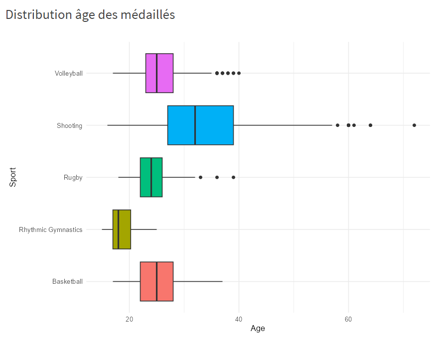
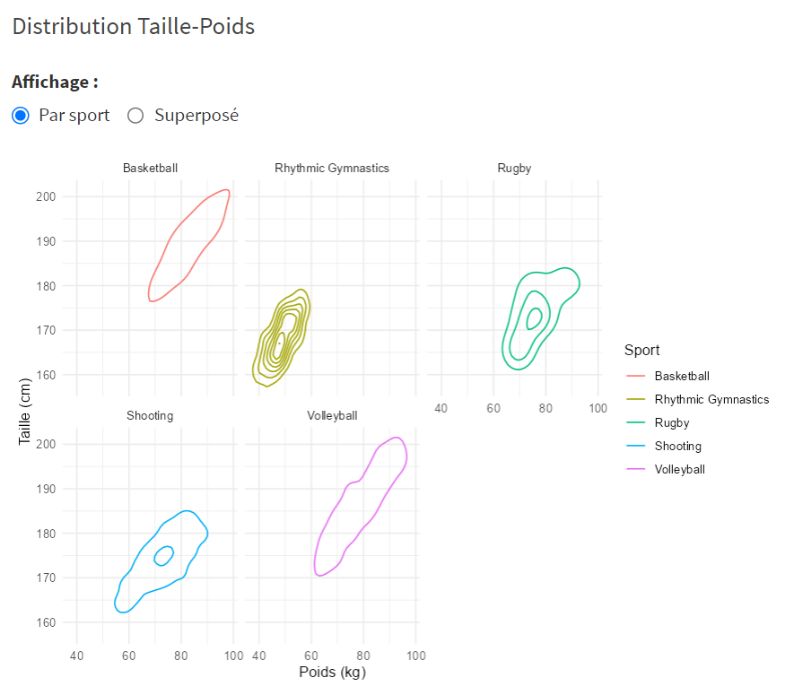
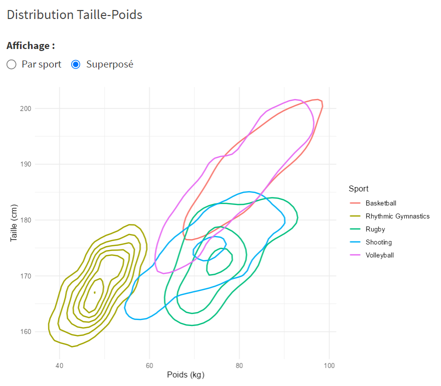
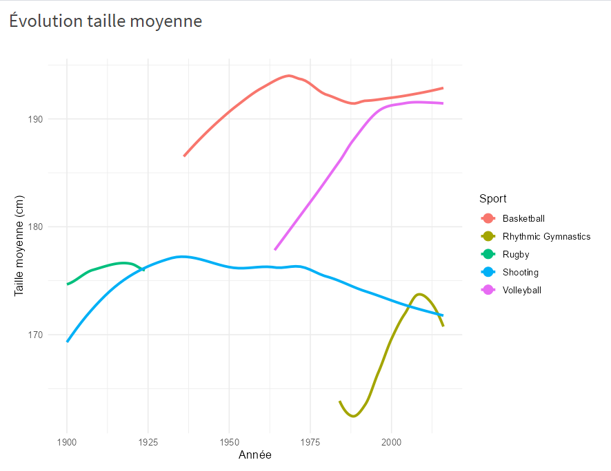
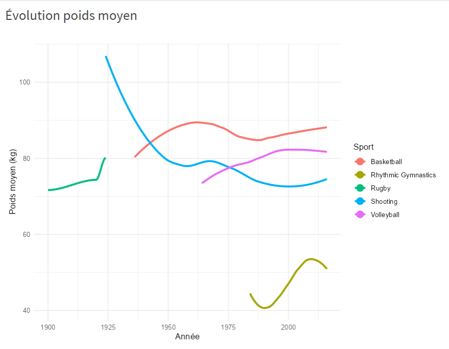
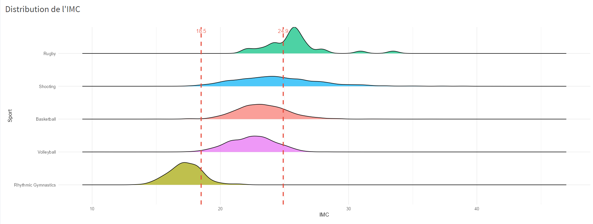

```{r setup, include=FALSE}
knitr::opts_chunk$set(echo = FALSE)

#install.packages("tidyverse")
#install.packages("dplyr")
#install.packages("ggplot2")
#install.packages("treemapify")
#install.packages("ggrepel")
library(tidyverse)
library(dplyr)
library(ggplot2)
library(ggrepel)
library(treemapify)
```

# Introduction

## Données

Le dataset est accessible avec ce lien : <https://www.kaggle.com/datasets/harshvgh/olympics?select=athlete_events.csv>

Les données proviennent de la plateforme Kaggle, qui propose des jeux de données publics pour la data science. Elles sont issues de sources officielles liées au International Olympic Committee et ont été structurées pour faciliter leur analyse.

Nous avons choisi ce dataset à la fois pour son intérêt personnel, le sport étant un sujet qui nous intéresse toutes les quatre, et pour la quantité importante de données disponibles. Sa richesse (variables démographiques, physiques et sportives) et sa profondeur historique (depuis 1896) offrent un fort potentiel d’analyse.

Ce jeu de données s’inscrit dans un contexte d’analyse exploratoire de données appliquée au sport, et constitue un bon support pour manipuler des données réelles avec R.

Dans notre analyse de ce dataset, nous allons nous concentrer sur le document ***athletes_event.csv***, le document *noc_regions.csv* permettant uniquement de lier le NOC et la région, deux colonnes présentes également dans le document *athletes_event.csv*

Ce document contient des données concernant tous **les athlètes ayant participé aux Jeux Olympiques modernes**, depuis la première édition en 1896 à Athènes.

Il y a environ **136k observations**, et chaque observation correspond à la **participation d'un athlète à une épreuve**.

Ce dataset est décrit par 15 variables :

| **Variable** | **Description** | **Type de valeur** | **Nature des données** | **Remarques** |
|---------------|---------------|---------------|---------------|---------------|
| **ID** | Identifiant du participant | Numérique | Discrète | Unique par participant, mais peut apparaître plusieurs fois (plusieurs participations) |
| **Name** | Nom et prénom du participant | Texte | Nominale |  |
| **Gender** | Genre du participant | Texte | Nominale | "F" (femme) ou "M" (homme) |
| **Age** | Âge du participant | Numérique | Continue, ordinale |  |
| **Height** | Taille du participant | Numérique | Discrète, ordinale | Peut être "NA" (Not Available) |
| **Weight** | Poids du participant | Numérique | Discrète, ordinale | Peut être "NA" |
| **Team** | Équipe représentée (souvent son pays) | Texte | Nominale |  |
| **NOC** | Code du comité national olympique (3 lettres) | Texte | Nominale |  |
| **Games** | Édition des JO (année + saison) | Texte | Nominale | Exemple : "1912 Summer" |
| **Year** | Année de participation | Numérique | Continue, ordinale |  |
| **Season** | Saison de JO | Texte | Nominale | "Summer" ou "Winter" |
| **City** | Ville hôte des JO | Texte | Nominale |  |
| **Sport** | Discipline sportive correspondante à la participation | Texte | Nominale |  |
| **Event** | Épreuve correspondante à la participation | Texte | Nominale |  |
| **Medal** | Médaille obtenue lors de l'épreuve | Texte | Nominale, ordinale | "Gold", "Silver", "Bronze" ou "NA" |

## Plan d’analyses

Afin de produire une analyse riche de ce dataset, nous avons décidé de ne pas nous limiter à une analyse exploratoire linéaire en se concentrant sur un aspect du sujet. En effet, nous avons pris la décision de nous mettre dans la peau de quatre profils différents pour lesquels une analyse de ces données permettrait de développer les connaissances sur les Jeux Olympiques. 

Chaque profil interrogera donc nos données avec ses propres objectifs : 

1.  **L'observateur temporel : Mesure des avancées sociétales et de l'impact des secousses géopolitiques sur l'évenement**

-   **Croissance globale :** Quelle est l'évolution du nombre d'athlètes et de nations (NOC) de 1896 à nos jours ?
    -   **Variables :** Year, ID (en comptant les valeurs uniques : n_distinct(ID)), NOC (n_distinct(NOC)).
    -   **Graphique :** Line chart avec une courbe pour les athlètes et une pour les nations.
    -   Remarque : Ajoute des geom_vline pour marquer les événements historiques majeurs
-   **Impact des saisons :** Comment la participation aux JO d'hiver se compare-t-elle à celle des JO d'été en termes de volume ? regarder si des nations sont plus présentes en hiver ou en été ?
    -   **Variables :** Year, Season, ID (unique).
    -   **Graphique :** Stacked area chart
    -   Remarque : JO Hiver et ete avaient lieux la même année jusqu'en 92
-   **Analyse du genre :** Quelle est la proportion d'hommes et de femmes au fil du temps ? Observe-t-on des sports qui ont atteint la parité plus rapidement que d'autres ?
    -   **Variables :** Year, Gender, ID (unique).
    -   **Graphique :** 100% Stacked bar chart
    -   Remarque : marqueur de l'année d'atteinte de la parité pour chaque sport ?
-   **Stabilité des délégations :** Comment varie la taille des grandes délégations par décennie et le statut d'accueillir les Jeux génère-t-il un volume d'athlètes exceptionnel ?
    -   **Variables :** Year, NOC, ID (unique).
    -   **Graphique :** Boxplots par décennie, pour voir la dispersion de la taille des délégations.

2.  **Le recruteur : Recherche de liens entre profil physique et performance**

-   **Profils types par sport :** Existe-t-il une distribution spécifique de la taille et du poids pour chaque discipline (ex: comparaison entre le Basket-ball et la Gymnastique) ?
    -   **Variables :** Height, Weight, Sport, Gender
    -   **Graphique :** Scatter plot avec le poids en X et la taille en Y
    -   Remarque : utilsation du 2D Density plot (courbes de niveau) pour éviter le chevauchement (overplotting) des points, utiliser des sports aux antipods pour rendre le graph lisible.
-   **Évolution corporelle :** La taille ou le poids moyen des médaillés a-t-il changé en un siècle pour un même sport ?
    -   **Variables :** Year, Height (moyenne), Weight (moyenne), Sport.
    -   **Graphique :** Line chart, lissé (avec geom_smooth()) incluant l'intervalle de confiance.
    -   Remarque : Filtrer uniquement les médaillés ?
-   **Âge de la performance :** Quel est l'âge moyen des médailles par sport ? Existe-t-il des disciplines de précocité versus des disciplines de maturité ?
    -   **Variables :** Age, Sport, Medal.
    -   **Graphique :** Violin plot ou Boxplot, classé par l'âge médian du sport le plus jeune au plus vieux.
-   **Indice de Masse Corporelle (IMC) :** Peut-on comparer l'IMC des athlètes pour identifier des clusters de performance ?
    -   **Variables :** Création d'une variable BMI = Weight / (Height/100)\^2.
    -   **Graphique :** Ridgeline plot, via le package ggridges

3.  **Bookmaker : Mesure de l’efficacité brute des nations pour prédire plus précisement**

-   **Domination par nation :** Quels pays (NOC) possèdent le plus grand nombre de médailles cumulées ? Evolution des médaille pour les grosse d'élégations.
    -   **Variables :** NOC, Medal (filtré sans NA), Event, Year.
    -   **Graphique :** Carte colorée selon volume de médailles ou Horizontal bar chart
-   **Efficacité des délégations :** Quel est le ratio “Médailles obtenues / Nombre d'athlètes envoyés“ par pays ? Une petite délégation peut-elle être plus efficace qu'une grande ?
    -   **Variables :** NOC, ID (unique), Medal (unique par épreuve).
    -   **Graphique :** Scatter plot, Axe X = Taille de la délégation, Axe Y = Nombre de médailles + ligne de régression "moyenne"
    -   Remarque : Créer un indicateur (Nombre d'épreuves avec médaille / Nombre d'épreuves participées).
-   **Spécialisation sportive :** Certaines nations sont-elles ultra-spécialisées dans un sport précis (en nombre de participants ou en médailles obtenues) ?
    -   **Variables :** NOC (filtré sur le top 20 nations), Sport, Medal.
    -   **Graphique :** Heatmap, Nations en Y, Sports en X, intensité de la couleur = pourcentage de médailles du pays venant de ce sport.
-   **Avantage du terrain :** Les pays hôtes (variable City) obtiennent-ils systématiquement plus de médailles l'année où ils reçoivent les Jeux ? Impact sur les prochains jeux ?
    -   **Variables :** NOC, Year, City, Medal. (Il faut un référentiel externe ou croiser City avec la nationalité de la ville).
    -   **Graphique :** Un Slope chart, pour comparer le nombre de médailles d'un pays à l'édition T-1 (avant d'accueillir), à l'édition T (pays hôte), et T+1 (après).

4.  **4. Analyse des disciplines et des épreuves : Audit du Programme Olympique**

*Pour cette dernière partie, nous adopterons la posture stratégique d'un auditeur du Comité International Olympique (CIO). L'objectif est d'analyser la santé, l'attractivité et le coût logistique des différents sports afin de justifier leur maintien, leur suppression ou leur évolution.*
- **L'Universalité des disciplines (Compétitivité mondiale vs Monopoles) :** Quels sports sont véritablement mondiaux (médailles réparties sur un grand nombre de pays) et lesquels sont des niches dominées par une poignée de nations ?
    - **Variables :** `Sport`, `NOC` (unique parmi les médaillés), `Year` (filtré sur l'ère moderne).
    - **Graphique :** Lollipop chart ou Bar chart horizontal.
- **L'empreinte logistique (Le "coût" en athlètes) :** Quels sont les sports les plus "gourmands" en quotas d'athlètes par rapport au nombre de médailles qu'ils distribuent (ex : comparaison entre les sports collectifs et la natation) ?
    - **Variables :** `Sport`, `ID` (unique par sport et par édition), `Event` (unique par sport).
    - **Graphique :** Scatter plot (Axe X = Nombre d'athlètes moyen par édition, Axe Y = Nombre d'épreuves ou médailles distribuées).
    - **Remarque :** Mettre en évidence la pression logistique des sports sur le village olympique.
- **La modernisation du programme (Vers la parité des épreuves) :** Comment l'offre sportive du CIO s'est-elle adaptée pour atteindre la parité ? Comment ont évolué les épreuves masculines, féminines et mixtes ?
    - **Variables :** `Year`, `Event` (pour extraire le type d'épreuve), `Gender`.
    - **Graphique :** Diverging bar chart (pyramide inversée) : par année, barres à gauche pour les épreuves "Men's", à droite pour "Women's", et au centre pour les épreuves "Mixed".
- **Pérennité et "Cimetière olympique" (L'instabilité du programme) :** Quels sont les sports "piliers" historiques présents sans interruption, et quels sont les sports éphémères ou de démonstration qui ont disparu du programme ?
    - **Variables :** `Sport`, `Year` (min, max et comptage des apparitions).
    - **Graphique :** Timeline plot (diagramme de Gantt) ou Waterfall chart illustrant les entrées et sorties des sports au fil des décennies.


**Limitations et défis**

-   **Biais historique :** Pour les données anciennes, on a moins de données sur la morphologie (taille, poids) avant la seconde guerre mondiale.
-   **Changements géopolitiques :** Le dataset prend en compte une grande période, alors vient la question des changement de nom pour les pays (on considère L’URSS comme la Russie ou comme un autre pays, …).
-   **Surreprésentation des sports collectifs :** Dans le fichier, une médaille d'or en Football compte pour 11 à 20 lignes (une par joueur), tandis qu'une médaille en 100m compte pour une seule ligne. Il faudra décider si l'on compte les médailles par athlète ou les médailles par épreuve.

# Partie exploration


```{r}
# Fusion des deux fichiers
athletes_events_part1 <- read_csv("./data/athletes_events-part1.csv")
athletes_events_part2 <- read_csv("./data/athletes_events-part2.csv")

athletes_full <- bind_rows(athletes_events_part1, athletes_events_part2)
```

## 1. L'observateur temporel : Mesure des avancées sociétales et de l'impact des secousses géopolitiques sur l'évenement

### Croissance globale : Quelle est l'évolution du nombre d'athlètes et de nations (NOC) de 1896 à nos jours ?

Pour cette première visualisation, l'objectif était d'analyser la **dynamique globale et l'essor des Jeux Olympiques modernes** de leur création en 1896 à la fin de notre période d'études en 2016.

Nous avons pris la décision d'utiliser le nombre d'athlètes et de nations en paramètres pour faire ressortir deux principales idées. Tout d'abord, la variation du nombre de nations est un bon indicateur pour déterminer l'ouverture de l'événement au monde et sa capacité à donner leur chance à des plus petites nations. D'un point de vue un peu plus logistique, l'évolution du nombre d'athlètes permet quant à elle de visualiser la capacité de l'événement à accueillir de plus en plus d'athlètes.

***Préparation des données***

Sur ces graphiques, nous avons décidé de marquer par des **"pauses" dans la courbe** les principaux événements historiques auxquels les Jeux Olympiques ont dû face en ajoutant notamment des valeurs nulles lorsqu’une édition a été annulée. Nous avons aussi normalisé les deux axes des abscisses pour permettre une comparaison rapide des courbes.

```{r}
df_croissance_brute <- athletes_full %>%
  group_by(Year) %>%
  summarise(
    Nb_Athletes = n_distinct(ID),
    Nb_Nations  = n_distinct(NOC)
  ) %>%
  ungroup()

df_guerres <- tibble(
  Year = c(1916, 1940, 1944),
  Nb_Athletes = c(0, 0, 0),
  Nb_Nations = c(0, 0, 0)
)

df_croissance <- bind_rows(df_croissance_brute, df_guerres) %>%
  arrange(Year)

facteur_echelle <- max(df_croissance_brute$Nb_Athletes) / max(df_croissance_brute$Nb_Nations)

ggplot(df_croissance, aes(x = Year)) +
  geom_line(aes(y = Nb_Athletes, color = "Athlètes"), linewidth = 1.2) +
  geom_point(aes(y = Nb_Athletes, color = "Athlètes"), size = 2) +
  
  geom_line(aes(y = Nb_Nations * facteur_echelle, color = "Nations"), linewidth = 1.2) +
  geom_point(aes(y = Nb_Nations * facteur_echelle, color = "Nations"), size = 2) +
  
  geom_vline(xintercept = c(1916, 1940, 1944), linetype = "dashed", color = "red", alpha = 0.6) +
  geom_vline(xintercept = 1980, linetype = "dotted", color = "orange", alpha = 0.8) +
  
  annotate("text", x = 1916, y = 8500, label = "Guerres\nMondiales", color = "red", size = 3, hjust = -0.1) +
  annotate("text", x = 1980, y = 8500, label = "Boycott\nMoscou", color = "orange", size = 3, hjust = -0.1) +
  
  scale_x_continuous(breaks = seq(1896, 2016, by = 12)) +
  scale_y_continuous(
    name = "Nombre total d'athlètes",
    sec.axis = sec_axis(~ . / facteur_echelle, name = "Nombre de nations (NOC)")
  ) +
  
  scale_color_manual(
    values = c("Athlètes" = "#3182bd", "Nations" = "#c51b8a"),
    name = "Indicateurs"
  ) +
  
  labs(
    title = "Évolution historique de la participation aux Jeux Olympiques",
    subtitle = "Croissance du nombre unique d'athlètes et de comités nationaux (1896 - 2016)",
    x = "Année"
  ) +
  theme_minimal(base_size = 12) +
  theme(
    panel.grid.minor = element_blank(),
    plot.title = element_text(face = "bold", size = 14),
    plot.subtitle = element_text(size = 10, color = "grey45"),
    legend.position = "bottom"
  )
```

***Analyse***

Sur ce graphique, notre vision pré-attentive est troublée car la fin de notre plage temporelle est marquée par une oscillation des courbes. Cela est dû au changement de déroulement des JO avant 1992, où les deux saisons de l’événement étaient regroupées dans la même année. On voit donc directement les **différences numériques de participation entre les deux saisons** : il y a à la fois moins d’athlètes participants et moins de nations participantes. Cette différence est notamment due au fait que les disciplines des JO d'été peuvent se pratiquer dans davantage de pays et nécessitent moins d'infrastructures que celles des JO d'hiver. Nous pouvons également observer un rapport nations/athlètes légèrement supérieur en hiver, ce qui signifie que les délégations font en moyenne participer moins d’athlètes en hiver qu’en été.

Après avoir analysé ces oscillations, il serait préférable de regrouper les éditions hiver/été sur des périodes de 4 ans pour pouvoir analyser la dynamique globale de l’événement. Nous avons donc réalisé le graphique ci-dessous en prenant en compte ce nouveau critère.
```{r}
df_croissance_brute <- athletes_full %>%
  group_by(Year) %>%
  summarise(
    Nb_Athletes = n_distinct(ID),
    Nb_Nations  = n_distinct(NOC)
  ) %>%
  ungroup()

df_guerres <- tibble(
  Year = c(1916, 1940, 1944),
  Nb_Athletes = c(0, 0, 0),
  Nb_Nations = c(0, 0, 0)
)

df_croissance_4ans <- bind_rows(df_croissance_brute, df_guerres) %>%
  mutate(Period_4ans = Year %/% 4 * 4) %>%
  group_by(Period_4ans) %>%
  summarise(
    Nb_Athletes = max(Nb_Athletes), 
    Nb_Nations  = max(Nb_Nations)
  ) %>%
  ungroup()

facteur_echelle <- max(df_croissance_4ans$Nb_Athletes) / max(df_croissance_4ans$Nb_Nations)
hauteur_texte <- max(df_croissance_4ans$Nb_Athletes) * 0.85

ggplot(df_croissance_4ans, aes(x = Period_4ans)) +
  geom_line(aes(y = Nb_Athletes, color = "Athlètes"), linewidth = 1.2) +
  geom_point(aes(y = Nb_Athletes, color = "Athlètes"), size = 2) +
  
  geom_line(aes(y = Nb_Nations * facteur_echelle, color = "Nations"), linewidth = 1.2) +
  geom_point(aes(y = Nb_Nations * facteur_echelle, color = "Nations"), size = 2) +

  geom_vline(xintercept = c(1916, 1940, 1944), linetype = "dashed", color = "red", alpha = 0.6) +
  geom_vline(xintercept = 1980, linetype = "dotted", color = "orange", alpha = 0.8) +
  
  annotate("text", x = 1916, y = 8500, label = "Guerres\nMondiales", color = "red", size = 3, hjust = -0.1) +
  annotate("text", x = 1980, y = 8500, label = "Boycott\nMoscou", color = "orange", size = 3, hjust = -0.1) +
  
  scale_x_continuous(breaks = seq(1896, 2016, by = 12)) +
  scale_y_continuous(
    name = "Volume maximum par Olympiade (4 ans)",
    sec.axis = sec_axis(~ . / facteur_echelle, name = "Nombre de nations (NOC)")
  ) +
  
  scale_color_manual(
    values = c("Athlètes" = "#3182bd", "Nations" = "#c51b8a"),
    name = "Indicateurs"
  ) +
  
  labs(
    title = "Tendance globale de la participation aux Jeux Olympiques",
    subtitle = "Cumul fusionné (Été + Hiver) par périodes de 4 ans (1896 - 2016)",
    x = "Période (Début de l'Olympiade)"
  ) +
  theme_minimal(base_size = 12) +
  theme(
    panel.grid.minor = element_blank(),
    plot.title = element_text(face = "bold", size = 14),
    legend.position = "bottom"
  )
```

Globalement, on peut observer une **hausse constante des deux courbes sur toute la période** de notre dataset. En effet, les premiers jeux olympiques n’étaient destinés qu’à quatorze nations et quelques centaines d’athlètes tandis que de nos jours plus de 10 000 athlètes et 190 nations sont présents lors de l’événement.

Les deux courbes évoluent relativement de la même manière au cours du temps. Il peut donc y avoir un lien entre le nombre de nations et d’athlètes, ce qui peut témoigner du fait que l’augmentation du nombre d’athlètes est aussi due à l’intégration de nouvelles nations au programme olympique. Ce n’est cependant probablement pas le seul paramètre entraînant une augmentation du nombre de participants, le nombre de sports étant également un paramètre déterminant la capacité d’accueil de l’événement.

Nous pouvons aussi observer l’impact des événements politiques mondiaux sur la participation. Même si durant les guerres les éditions ont été annulées, nous pouvons voir que les éditions précédant et suivant chaque guerre présentent environ le même nombre d’athlètes. Les guerres n’ont donc pas eu d’impact négatif sur la croissance de l’événement, en termes de nombre de nations et de participants en tout cas.

Nous pouvons aussi visualiser une forte baisse dans la participation en 1980 lors du **boycott de Moscou**. Ce mouvement d’opposition a été initié par les États-Unis pour protester contre l'invasion soviétique de l'Afghanistan. L’édition suivante a quant à elle été boycottée à son tour par les alliés soviétiques, mouvement que l’on peut moins observer sur la courbe.

### Impact des saisons : Comment la participation aux JO d'hiver se compare-t-elle à celle des JO d'été en termes de volume ?

Nous avons rapidement vu dans les graphiques précédents qu’il y a moins de participants aux Jeux Olympiques d’hiver que d’été, mais ces graphiques n’ont pas été conçus pour comparer les affluences des deux événements. Nous avons donc décidé de **comparer les volumes à l’aide d’un graphique d’aires empilées**.

***Préparation des données***

Pour ce graphique, nous avons également ajouté les éditions annulées à cause des guerres en leur associant des valeurs nulles.

```{r}
df_seasons_brute <- athletes_full %>%
  group_by(Year, Season) %>%
  summarise(Nb_Athletes = n_distinct(ID), .groups = "drop")

df_annulees <- tibble(
  Year = c(1916, 1940, 1940, 1944, 1944),
  Season = c("Summer", "Summer", "Winter", "Summer", "Winter"),
  Nb_Athletes = c(0, 0, 0, 0, 0)
)

df_seasons <- bind_rows(df_seasons_brute, df_annulees) %>%
  arrange(Year, desc(Season)) %>%
  mutate(Edition = paste(Year, if_else(Season == "Summer", "Été", "Hiver")))

df_seasons$Edition <- factor(df_seasons$Edition, levels = unique(df_seasons$Edition))

ggplot(df_seasons, aes(x = Edition, y = Nb_Athletes, fill = Season, group = Season)) +
  geom_area(position = "stack", alpha = 0.85, color = "white", linewidth = 0.1) +
  
  geom_vline(xintercept = c(which(levels(df_seasons$Edition) == "1916 Été"), 
                            which(levels(df_seasons$Edition) == "1940 Hiver")), 
             linetype = "dotted", color = "red", alpha = 0.7, linewidth = 0.7) +
  
  annotate("text", x = which(levels(df_seasons$Edition) == "1940 Hiver"), 
           y = max(df_seasons$Nb_Athletes) * 1.1, 
           label = "Guerres mondiales", color = "red", size = 3, hjust = 1.1) +

  scale_fill_manual(
    values = c("Summer" = "#E65C00", "Winter" = "#2B7A94"),
    labels = c("Summer" = "JO d'Été", "Winter" = "JO d'Hiver"),
    name = "Saison"
  ) +
  
  scale_x_discrete(breaks = levels(df_seasons$Edition)[seq(1, length(levels(df_seasons$Edition)), by = 4)]) +
  
  labs(
    title = "Impact des saisons sur la participation olympique",
    subtitle = "Volume d'athlètes uniques empilés (1896 - 2016)",
    x = "Édition des Jeux",
    y = "Nombre total d'athlètes (Cumulé)"
  ) +
  theme_minimal(base_size = 12) +
  theme(
    axis.text.x = element_text(angle = 45, hjust = 1, size = 9),
    panel.grid.minor = element_blank(),
    plot.title = element_text(face = "bold", size = 14),
    plot.subtitle = element_text(size = 10, color = "grey45"),
    legend.position = "bottom"
  )
```

***Analyse***

L’analyse sautant aux yeux dans ce graphique est la **grande domination des Jeux Olympiques d'été** : le graphique est en grande majorité orange.

Comme sur les graphiques précédents, nous voyons bien les pauses durant les guerres et l’impact du boycott de Moscou sur la participation.

Sur ce graphique, nous avons pour la première fois l’entièreté de la courbe des Jeux d’hiver et pouvons voir que la séparation des saisons en 1992 n’a pas vraiment eu d’impact sur la capacité d’accueil de l’événement. Une légère croissance au long de l’histoire des Jeux Olympiques hivernaux est cependant importante à notifier. Nous remarquons aussi pour la première fois que la première édition des JO d’hiver a eu lieu en 1924.

Notre dataset s’arrêtant sur une édition de Jeux d’été, un petit bug visuel dû à l’arrêt de l’aire des JO d’hiver fait croire à une soudaine décroissance dans la participation aux JO d’été. Celle-ci est évidemment faussée : l’aire d’été continue de grandir sur cette période.

Un petit bémol demeure sur ce graphique : l’aire dédiée aux Jeux Olympiques d'été étant positionnée au-dessus de celle des Jeux d'hiver, sa propre vitesse d'évolution s'additionne visuellement à la première. Le *stacked area chart* n’est donc pas forcément le type de visualisation le plus adapté à la comparaison de la progression des deux courbes, même si elle nous a permis d’analyser les différences saisonnières sur différents aspects. Nous avons donc décidé de **créer un line chart classique pour mieux visualiser les deux tendances** et affiner notre analyse.

```{r}
df_saisons_brute <- athletes_full %>%
  group_by(Year, Season) %>%
  summarise(Nb_Athletes = n_distinct(ID), .groups = "drop")

df_annulees <- tibble(
  Year = c(1916, 1940, 1940, 1944, 1944),
  Season = c("Summer", "Summer", "Winter", "Summer", "Winter"),
  Nb_Athletes = c(0, 0, 0, 0, 0)
)

df_tendances_saisons <- bind_rows(df_saisons_brute, df_annulees) %>%
  mutate(Period_4ans = Year %/% 4 * 4) %>%
  group_by(Period_4ans, Season) %>%
  summarise(Nb_Athletes = max(Nb_Athletes), .groups = "drop")

ggplot(df_tendances_saisons, aes(x = Period_4ans, y = Nb_Athletes, color = Season, group = Season)) +
  geom_line(linewidth = 1.3) +
  geom_point(size = 2.5) +
  
  geom_vline(xintercept = c(1916, 1940), linetype = "dashed", color = "red", alpha = 0.5) +
  
  scale_x_continuous(breaks = seq(1896, 2016, by = 12)) +
  scale_y_continuous(labels = scales::comma) +
  
  scale_color_manual(
    values = c("Summer" = "#E65C00", "Winter" = "#2B7A94"),
    labels = c("Summer" = "JO d'Été", "Winter" = "JO d'Hiver"),
    name = "Saison"
  ) +
  
  labs(
    title = "Comparaison de la vitesse d'évolution : JO d'Été vs JO d'Hiver",
    subtitle = "Tendances par blocs de 4 ans (1896 - 2016)",
    x = "Période (Bloc de 4 ans)",
    y = "Nombre d'athlètes uniques"
  ) +
  theme_minimal(base_size = 12) +
  theme(
    panel.grid.minor = element_blank(),
    plot.title = element_text(face = "bold", size = 14),
    plot.subtitle = element_text(size = 10, color = "grey45"),
    legend.position = "bottom"
  )
```

Ce graphique nous confirme la différence de croissance entre les deux saisons et la **forte domination des Jeux d’été lors des dernières éditions**, accueillant environ 3,5 fois plus d’athlètes.

### Analyse du genre

#### **Quelle est la proportion d'hommes et de femmes au fil du temps ?**

Pour cette question, l'objectif est principalement de visualiser la **répartition et l'évolution des participations en termes de genre**. Le sport féminin se développant d'année en année, nous pouvons imaginer que la proportion des femmes a augmenté ces dernières décennies alors qu'elle était très faible au début du siècle dernier.

***Préparation des données***

Afin d'avoir une proportion fiable où chaque participant compte autant qu'un autre, il était nécessaire de préparer les données en **supprimant les doublons**. En effet, une personne participant à plusieurs épreuves ne devrait pas avoir plus de poids qu'un participant à une épreuve unique.

Nous avions également besoin de créer une nouvelle colonne nommée proportion qui représente la proportion des lignes de genres similaires pour une même année.

```{r}
df_gender <- athletes_full %>%
  distinct(ID, Year, Gender) %>% 
  
  count(Year, Gender) %>%
  group_by(Year) %>%
  
  mutate(proportion = n / sum(n)) %>%
  ungroup()
```

```{r}
ggplot(df_gender, aes(x = Year, y = proportion, fill = Gender)) +
  geom_bar(stat = "identity", position = "fill", width = 2) +
  
  geom_hline(
    yintercept = 0.5,
    linetype = "dashed",
    colour = "white"
  ) +
  
  scale_y_continuous(
    labels = scales::percent_format(accuracy = 1),
    expand = c(0, 0)
  ) +
  
  scale_x_continuous(breaks = seq(1896, 2016, by = 4)) +
  scale_fill_manual(
    values = c("F" = "#1D9E75", "M" = "#7F77DD"),
    labels = c("F" = "Femmes", "M" = "Hommes")
  ) +
  
  labs(
    title = "Proportion hommes/femmes aux Jeux Olympiques",
    subtitle = "Ligne pointillée = parité 50/50",
    x = "Année",
    y = "Proportion",
    fill = "Genre"
  ) +
  
  theme(
    axis.text.x = element_text(angle = 60, hjust = 1),
    legend.position = "bottom",
    plot.title = element_text(face = "bold", size = 14),
    plot.subtitle = element_text(size = 10, colour = "grey45"),
    plot.caption = element_text(size = 6, colour = "grey55")
  )
```

***Analyse***

Tout d'abord, la première édition des Jeux Olympiques en 1896 à Athènes était **entièrement interdite aux femmes**. La première année, la proportion d'hommes dans les participants est donc de 100%.

Depuis cette première édition, on peut voir que les femmes participent de plus en plus. Les participations féminines ont cependant mis beaucoup de temps à se rapprocher d'une certaine parité. En effet, il aura fallu 92 ans (1896 - 1988) pour voir une édition avec un quart de participations féminines : une très faible croissance de la proportion des participations féminines est à observer sur cette période.

Suite à ce cap des 25%, la proportion de participations féminines a continué à augmenter et à se rapprocher de plus en plus des participations masculines, atteignant 45% en 2016. Nous ne sommes donc toujours pas à une réelle parité, mais celle-ci **tend progressivement à être atteinte**. L'ajout de données à propos des JO de Tokyo en 2021 et de Paris en 2024 pourrait préciser cette tendance.

Nous pouvons également observer sur le graphique que les Jeux Olympiques d'hiver comptent moins de participations féminines que les éditions d'été. Par exemple, nous pouvons notifier des hausses significatives de la participation masculine entre 2004 (été) et 2006 (hiver), 2008 (été) et 2010 (hiver), et 2012 (été) et 2014 (hiver).

Il reste donc globalement une majorité de participations masculines aux Jeux Olympiques, même si la parité tend à être atteinte. Nous pouvons maintenant nous demander quels sont les sports ayant déjà atteint la parité et quels sports impactent négativement la tendance globale, en restant dominés par une grande majorité masculine et freinant l'avancée vers une représentation équilibrée des genres.

#### **Observe-t-on des sports qui ont atteint la parité plus rapidement que d'autres ?**

Pour répondre à cette question, l’objectif est de retrouver à la fois tous les sports ayant atteint la parité dans les participations et le **nombre d’années qu’il a fallu attendre pour l’atteindre** depuis l’instauration du sport.

***Préparation des données***

Nous avons décidé de représenter l’atteinte de la parité par un **lollipop chart**, avec toutes les lignes de vie des sports ayant atteint la parité. Nous avons déterminé que la parité était atteinte lorsque le pourcentage de participation féminine se trouvait entre 45% et 55% lors d’une édition, la parité parfaite étant un peu trop précise à atteindre.

```{r}
df_sport_gender <- athletes_full %>%
  distinct(ID, Year, Sport, Gender) %>%
  count(Year, Sport, Gender) %>%
  group_by(Year, Sport) %>%
  mutate(prop_femmes = n / sum(n)) %>%
  filter(Gender == "F") %>%
  ungroup()

df_debut_sports <- athletes_full %>%
  group_by(Sport) %>%
  summarise(Annee_Debut = min(Year, na.rm = TRUE), .groups = "drop")

df_parite_sports <- df_sport_gender %>%
  filter(prop_femmes >= 0.45, prop_femmes <= 0.55) %>%
  group_by(Sport) %>%
  summarise(Annee_Parite = min(Year, na.rm = TRUE), .groups = "drop") %>%
  inner_join(df_debut_sports, by = "Sport") %>%
  mutate(
    Annees_Attente = Annee_Parite - Annee_Debut,
    # Si le sport est paritaire dès le début (0 an), on met une étiquette spécifique ou "0 ans"
    Label_Attente = if_else(Annees_Attente == 0, "Dès l'instauration", paste0(Annees_Attente, " ans"))
  ) %>%
  arrange(Annee_Parite)

ggplot(df_parite_sports, aes(x = reorder(Sport, -Annee_Parite), y = Annee_Parite)) +
  # CHANGEMENT CLÉ : yend pointe maintenant vers Annee_Debut
  geom_segment(aes(xend = reorder(Sport, -Annee_Parite), yend = Annee_Debut), 
               color = "#1D9E75", linewidth = 0.6) +
  
  geom_point(color = "#1D9E75", size = 3.5) +
  geom_point(aes(y = Annee_Debut), color = "grey60", size = 1.5, shape = 1) +
  geom_text(aes(label = Label_Attente), hjust = -0.15, vjust = 0.4, size = 2.8, color = "grey30") +
  
  coord_flip() +
  # Ajustement des limites pour laisser de la place aux textes à droite
  scale_y_continuous(breaks = seq(1896, 2016, by = 20), limits = c(1896, 2040)) +
  
  labs(
    title = "Atteinte la parité par discipline olympique",
    subtitle = "Première édition (45%-55% de femmes) et durée écoulée pour l'atteindre",
    x = NULL,
    y = "Chronologie (1896 - 2016)"
  ) +
  theme_minimal(base_size = 12) +
  theme(
    panel.grid.minor = element_blank(),
    plot.title = element_text(face = "bold", size = 14),
    plot.subtitle = element_text(size = 10, color = "grey45"),
    axis.text.y = element_text(face = "bold")
  )
```

***Analyse***

Nous pouvons d’abord observer sur ce diagramme que **27 sports ont déjà atteint la parité**, ce qui représente un peu plus de la majorité des disciplines étudiées.

Au total, 7 sports étaient paritaires dès leur instauration. Cela n’est pas un événement rencontré fréquemment, le golf faisant partie de ce groupe alors qu’il est arrivé dans le programme olympique en 1900. Le sport le plus récent de notre dataset ayant atteint cet objectif est le rugby à 7, probablement puisque c’est un sport collectif et que le nombre d’équipes et de joueurs par équipe est réglementé. Entre temps, d’autres sports comme le badminton, le triathlon et le taekwondo ont également été paritaires dès leur entrée dans le programme.

Certaines lignes de vie très longues s’observent sur le graphique. En effet, des sports historiques de l’événement n’ont atteint la parité que très tard. C’est particulièrement le cas du tennis, du tir à l’arc, de l’athlétisme et de l’escrime. Dans le cas de l’athlétisme, cela peut peut-être être expliqué par le très grand nombre de disciplines impliquées, demandant des progrès dans le règlement de beaucoup d’épreuves.

Nous pouvons aussi observer sur ce graphique une **période de progrès majeurs concentrée entre 1992 et 2000**, durant laquelle 17 sports ont subitement atteint cet objectif de parité.

### Stabilité des délégations : Comment varie la taille des grandes délégations par décennie et le statut d'accueillir les Jeux génère-t-il un volume d'athlètes exceptionnel ?

L’objectif de cette visualisation est d’analyser la dispersion des 20 plus grandes délégations olympiques au fil des décennies et de mesurer l’impact du statut de pays organisateur sur le volume d’athlètes participants à leur édition. 

***Préparation des données***

Pour répondre à cette question, nous nous sommes concentrés sur le comportement des délégations majeures. Nous avons donc uniquement gardé les 20 plus grandes nations de chaque décennie. Les données sont également séparées par saison à l’aide de la librairie ggrepel étant donné que le volume de participant différent grandement entre les deux événements.


```{r fig.width=16, fig.height=6}

df_delegations <- athletes_full %>%
  group_by(Year, Season, NOC) %>%
  summarise(Taille_Delegation = n_distinct(ID), .groups = "drop") %>%
  mutate(Decade = paste0(Year %/% 10 * 10, "s"))

pays_hotes <- tibble(
  Year = c(1896, 1900, 1904, 1908, 1912, 1920, 1924, 1924, 1928, 1928, 1932, 1932, 1936, 1936, 1948, 1948, 1952, 1952, 1956, 1956, 1960, 1960, 1964, 1964, 1968, 1968, 1972, 1972, 1976, 1976, 1980, 1980, 1984, 1984, 1988, 1988, 1992, 1992, 1994, 1996, 1998, 2000, 2002, 2004, 2006, 2008, 2010, 2012, 2014, 2016),
  Season = c("Summer", "Summer", "Summer", "Summer", "Summer", "Summer", "Summer", "Winter", "Summer", "Winter", "Summer", "Winter", "Summer", "Winter", "Summer", "Winter", "Summer", "Winter", "Summer", "Winter", "Summer", "Winter", "Summer", "Winter", "Summer", "Winter", "Summer", "Winter", "Summer", "Winter", "Summer", "Winter", "Summer", "Winter", "Summer", "Winter", "Summer", "Winter", "Winter", "Summer", "Winter", "Summer", "Winter", "Summer", "Winter", "Summer", "Winter", "Summer", "Winter", "Summer"),
  NOC_Hote = c("GRE", "FRA", "USA", "GBR", "SWE", "BEL", "FRA", "FRA", "NED", "SUI", "USA", "USA", "GER", "GER", "GBR", "SUI", "FIN", "NOR", "AUS", "ITA", "ITA", "USA", "JPN", "AUT", "MEX", "FRA", "GER", "JPN", "CAN", "AUT", "RUS", "USA", "USA", "YUG", "KOR", "CAN", "ESP", "FRA", "NOR", "USA", "JPN", "AUS", "USA", "GRE", "ITA", "CHN", "CAN", "GBR", "RUS", "BRA")
)

df_delegations <- df_delegations %>%
  left_join(pays_hotes, by = c("Year", "Season")) %>%
  mutate(
    Statut = if_else(NOC == NOC_Hote, "Pays Hôte", "Normal"),
    Season_Label = if_else(Season == "Summer", "JO d'Été", "JO d'Hiver")
  )

top_20_noc <- athletes_full %>%
  group_by(NOC) %>%
  summarise(Total_Historic = n_distinct(ID)) %>%
  slice_max(Total_Historic, n = 20) %>%
  pull(NOC)

df_delegations_top <- df_delegations %>%
  filter(NOC %in% top_20_noc)

ggplot(df_delegations_top, aes(x = Decade, y = Taille_Delegation)) +
  geom_boxplot(fill = "#2B7A94", alpha = 0.4, color = "grey30", outlier.shape = NA) +
  
  geom_jitter(
    data = filter(df_delegations_top, Statut == "Normal"),
    color = "grey50", size = 1.2, alpha = 0.3, width = 0.15
  ) +
  
  geom_point(
    data = filter(df_delegations_top, Statut == "Pays Hôte"),
    aes(color = Season), size = 2.8, alpha = 0.95
  ) +
  
  geom_text_repel(
    data = filter(df_delegations_top, Statut == "Pays Hôte"),
    aes(label = paste0(NOC, " (", Year, ")"), color = Season),
    size = 2.4,
    fontface = "bold",
    direction = "both",
    nudge_x = 0.25,
    box.padding = 0.35,
    point.padding = 0.3,
    max.overlaps = Inf,
    segment.size = 0.3,
    segment.alpha = 0.5,
    show.legend = FALSE
  ) +
  
  facet_wrap(~ Season_Label, scales = "free_y") +
  
  scale_x_discrete(expand = expansion(mult = c(0.05, 0.15))) +
  
  scale_color_manual(
    values = c("Summer" = "#E65C00", "Winter" = "#0077B6"),
    labels = c("Summer" = "Hôte d'Été", "Winter" = "Hôte d'Hiver"),
    name = "Statut"
  ) +
  
  labs(
    title = "Analyse comparative de la taille des délégations et effet du pays hôte",
    subtitle = "Dispersion par décennie (Top 20 nations)",
    x = "Décennie",
    y = "Nombre d'athlètes uniques par délégation"
  ) +
  theme_minimal(base_size = 12) +
  theme(
    panel.grid.minor = element_blank(),
    plot.title = element_text(face = "bold", size = 14),
    axis.text.x = element_text(angle = 45, hjust = 1),
    legend.position = "bottom",
    strip.text = element_text(face = "bold", size = 12, color = "grey20"),
    strip.background = element_rect(fill = "grey95", color = "transparent")
  )
```

***Analyse :*** 

L'observation des Jeux d'hiver montre que les boxplots s'élèvent de manière continue au fil du temps, ce qui traduit une ***présence de plus en plus forte des grandes nations***. La limite inférieure des boîtes est également en hausse constante : cela signifie que même les nations les plus faibles de ce Top 20 connaissent une augmentation structurelle de leur nombre d'athlètes.

Concernant l'impact de l'organisation des Jeux, ***les pays hôtes se positionnent systématiquement parmi les délégations les plus massives*** de leur décennie. Ce phénomène s'explique principalement par les privilèges réglementaires et les places réservées d'office au pays organisateur dans de nombreuses disciplines.

L'édition de 1908 au Royaume-Uni illustre parfaitement cette dynamique de manière extrême. Alors que le nombre total d'athlètes toutes nations confondues avoisinait les 2 000 participants, le pays hôte a envoyé à lui seul environ 700 athlètes. Ce volume exceptionnel représente un ***record historique de concentration*** pour une nation organisatrice dans l'histoire des Jeux Olympiques.

---

## 2. Le recruteur : Recherche de liens entre profil physique et performance

Afin d’explorer plus finement les différences morphologiques entre disciplines, nous avons utilisé une **interface interactive développée avec Shiny** permettant de sélectionner dynamiquement les sports à comparer.

Cette approche présente deux avantages : elle facilite les comparaisons visuelles et permet d’adapter l’analyse selon le profil recherché (sports d’endurance, sports collectifs, disciplines techniques, etc.).

Pour illustrer les résultats, nous avons sélectionné cinq disciplines présentant des caractéristiques très contrastées :

* **Basketball** : sport collectif où la taille constitue souvent un avantage ;
* **Volleyball** : discipline également orientée vers la taille mais avec des contraintes physiques différentes ;
* **Rugby** : sport de contact nécessitant puissance et masse corporelle ;
* **Rhythmic Gymnastics** : discipline mettant en avant légèreté, souplesse et contrôle corporel ;
* **Shooting** : sport davantage orienté vers la précision et la stabilité.

L’objectif est de mettre en évidence l’existence éventuelle de profils corporels spécifiques selon les disciplines.

---

### Âge de la performance

#### Quel est l'âge moyen des médaillés par sport ? Existe-t-il des disciplines de précocité versus des disciplines de maturité ?

L’objectif de cette analyse est d’étudier la **distribution de l’âge des athlètes médaillés selon leur discipline**, afin d’identifier si certains sports favorisent des performances précoces alors que d’autres valorisent davantage l’expérience.

Nous pouvons supposer que les disciplines nécessitant des qualités physiques très spécifiques, comme la souplesse ou l’explosivité, conduisent à des performances plus jeunes, tandis que des sports davantage centrés sur la maîtrise technique permettent des carrières plus longues.

#### Préparation des données

Pour cette analyse :

* seuls les **athlètes ayant remporté une médaille** ont été conservés ;
* les observations avec un **âge manquant** ont été supprimées ;
* les sports ont été sélectionnés via l’interface interactive.

La distribution des âges a été représentée à l’aide de **boxplots**, permettant d’observer l’âge médian ainsi que la dispersion des performances.



#### Analyse

Sur l’ensemble du jeu de données, l’**âge moyen des athlètes médaillés est d’environ 25 ans**.

Nous observons que le **basketball**, le **volleyball** et le **rugby** présentent des distributions relativement proches de cette valeur. Ces disciplines semblent atteindre leur optimum dans une période où se combinent **capacités physiques élevées, expérience compétitive et maturité sportive**.

La **gymnastique rythmique** se distingue nettement avec des âges plus faibles. Les performances semblent y être atteintes plus tôt dans la carrière sportive. Ce résultat peut s’expliquer par les exigences de la discipline, qui reposent fortement sur la **souplesse**, la **mobilité**, la **coordination fine** et un **rapport poids/puissance très exigeant**, caractéristiques généralement plus marquées chez les athlètes jeunes.

À l’inverse, le **tir** présente une distribution beaucoup plus étalée avec des athlètes médaillés sur une plage d’âge très large. Contrairement aux sports où les performances dépendent principalement des capacités physiques, le tir mobilise davantage des compétences liées à la **précision**, à la **concentration**, au **contrôle émotionnel** et à l’**expérience accumulée au cours de la carrière**.

Cette première analyse montre ainsi que **l’âge optimal de performance varie fortement selon les exigences propres à chaque discipline sportive**.

---

### Profils types par sport

#### Existe-t-il une distribution spécifique de la taille et du poids pour chaque discipline ?

L’objectif est ici d’observer si certaines disciplines présentent des profils physiques caractéristiques à travers la **distribution conjointe de la taille et du poids**.

Nous pouvons nous attendre à retrouver des regroupements distincts selon les contraintes du sport : les disciplines nécessitant de la puissance ou un avantage mécanique devraient favoriser certains gabarits, tandis que d’autres privilégieraient la légèreté ou la mobilité.

#### Préparation des données

Nous avons conservé uniquement :

* les sports sélectionnés dans l’interface Shiny ;
* les observations avec une **taille et un poids renseignés**.

Afin d’éviter le chevauchement des observations, nous avons utilisé des **courbes de densité 2D**, qui mettent en évidence les zones où les athlètes sont les plus concentrés.





#### Analyse

Le graphique met en évidence des **profils morphologiques très différenciés selon les disciplines**.

La **gymnastique rythmique** apparaît comme le sport le plus distinct : les athlètes se concentrent autour de tailles et poids relativement faibles. Ce résultat est cohérent avec les exigences de la discipline, qui valorise la **souplesse, l’agilité, l’amplitude des mouvements et le contrôle corporel**.

À l’opposé, le **basketball** présente une concentration située sur des tailles nettement plus élevées. Une grande taille offre un avantage mécanique important pour atteindre le panier, défendre ou couvrir davantage d’espace.

Le **volleyball** montre une distribution très proche de celle du basketball, particulièrement lorsque les courbes sont superposées. Les deux disciplines recherchent des athlètes grands avec une masse corporelle relativement similaire afin d’optimiser la portée verticale et l’efficacité au filet.

Le **rugby** occupe une position intermédiaire mais davantage étendue sur l’axe du poids, ce qui reflète la coexistence de profils très différents selon les postes (avants plus massifs, arrières plus mobiles).

Enfin, le **tir** présente une distribution plus compacte et moins extrême, suggérant que les performances dépendent davantage de facteurs techniques que de caractéristiques physiques particulières.

Cette analyse montre que certaines disciplines semblent sélectionner naturellement des morphologies spécifiques.

---

### Évolution corporelle

#### La taille ou le poids moyen des médaillés a-t-il changé au cours du temps ?

Cette question vise à observer si le profil physique des athlètes médaillés s’est transformé au fil du dernier siècle.

Nous pouvons supposer qu’avec la professionnalisation du sport, l’amélioration de l’entraînement et une sélection plus poussée des athlètes, certains sports ont progressivement convergé vers des morphologies plus spécialisées.

#### Préparation des données

Nous avons :

* conservé uniquement les **athlètes médaillés** ;
* supprimé les valeurs manquantes ;
* calculé pour chaque année et chaque sport :

  * la taille moyenne ;
  * le poids moyen.

Les tendances ont ensuite été représentées à l’aide de courbes lissées.





#### Analyse

Les résultats montrent que les caractéristiques physiques ont globalement évolué au cours du temps.

Concernant la **taille**, le basketball se distingue avec une augmentation progressive puis une stabilisation autour de valeurs élevées. Cette tendance peut s’expliquer par une sélection croissante des profils les plus avantagés biomécaniquement.

Le **volleyball** suit une trajectoire très proche et semble progressivement converger vers des caractéristiques comparables à celles observées en basketball. Cette proximité confirme l’importance croissante de la taille dans les sports où le jeu aérien est central.

À l’inverse, la **gymnastique rythmique** conserve des tailles plus faibles et relativement stables dans le temps.

Concernant le **poids**, la gymnastique reste également la discipline la plus éloignée des autres avec des valeurs nettement inférieures, cohérentes avec les contraintes esthétiques et techniques du sport.

Le rugby conserve des poids élevés, ce qui traduit l’importance de la puissance et du contact physique.

Ainsi, bien que les profils aient évolué avec le temps, chaque discipline semble conserver un « profil cible » relativement stable.

---

### Indice de Masse Corporelle (IMC)

#### Peut-on comparer l’IMC des athlètes pour identifier des profils de performance ?

L’objectif est ici d’étudier si certaines disciplines présentent des regroupements particuliers en termes d’IMC.

L’IMC est calculé selon :

[
IMC=\frac{Poids}{(Taille/100)^2}
]

Selon les recommandations médicales classiques :

* **IMC < 18,5** : insuffisance pondérale ;
* **18,5 ≤ IMC ≤ 24,9** : zone considérée comme normale ;
* **IMC > 25** : surpoids.

#### Préparation des données

Nous avons :

* calculé l’IMC pour chaque athlète disposant d’une taille et d’un poids ;
* conservé uniquement les sports sélectionnés ;
* représenté les distributions via un **Ridgeline plot**.



#### Analyse

Le graphique montre que les disciplines ne présentent pas les mêmes distributions d’IMC.

Le **rugby** apparaît majoritairement au-dessus de la zone classique considérée comme normale. Cependant, cela ne signifie pas nécessairement un excès de masse grasse : l’IMC ne distingue pas le **muscle du tissu adipeux**, et les rugbymen développent généralement une masse musculaire importante pour répondre aux exigences de puissance et de contact.

À l’opposé, la **gymnastique rythmique** présente une distribution largement située sous ou proche du seuil de 18,5. Plusieurs facteurs peuvent l’expliquer : recherche d’un faible poids relatif, exigences esthétiques, entraînements intensifs et parfois pression sur le maintien d’une silhouette très fine.

Les autres disciplines se concentrent davantage autour de la plage standard.

Cette analyse montre cependant une limite importante : **l’IMC constitue un indicateur imparfait pour étudier les sportifs de haut niveau**. Deux athlètes ayant le même IMC peuvent présenter des compositions corporelles très différentes. Pour évaluer précisément la condition physique d’un sportif, des indicateurs comme le **pourcentage de masse grasse** ou la **composition corporelle** seraient plus pertinents.

---

## 3. Bookmaker : Mesure de l’efficacité brute des nations pour prédire plus précisement

### Analyse du cumul des médailles par nation

#### Quels pays (NOC) possèdent le plus grand nombre de médailles cumulées ?

L'objectif ici est d'identifier les nations qui ont **marqué l'histoire des jeux Olympiques** par leur volume de podiums. Nous supposons que les grandes puissances (USA, Russie, pays européens) dominent le classement refletant un investissement de ces pays dans le sport de haut niveau despuis des années.

***Préparation des données***

Pour que l'analyse soit juste, il est primordial de traiter le problème des sports collectifs. Dans le dataset original, chaque joueur d'une équipe de basket victorieuse reçoit une ligne "Gold". Si nous comptions simplement les lignes, une victoire des USA en basket compterait pour 12 médailles, alors qu'une victoire au 100m compterait pour 1.

Nous utilisons donc **distinct()** pour ne compter qu'une seule médaille par pays, par medaille, par événement et par année. Nous filtrons ensuite le Top 15 pour obtenir une visualisation lisible.

```{r}
# Doublon : Pour compter 1 médaille par pays/épreuve, on utilise distinct() sur les colonnes clés.
medal_data <- athletes_full %>%
  filter(!is.na(Medal)) %>%
  distinct(NOC, Games, Year, Event, Medal, .keep_all = TRUE) 

# Calcul du top 15
top_pays <- medal_data %>%
  group_by(NOC) %>%
  summarise(Total_Medals = n()) %>%
  slice_max(Total_Medals, n = 15)

# Visualisation
ggplot(top_pays, aes(x = reorder(NOC, Total_Medals), y = Total_Medals)) +
  geom_col(fill = "#002147", width = 0.7) +
  
  # permet de tourner le graph
  coord_flip() +
  
  # info graph
  labs(
    title = "Top 15 des puissances olympiques historiques",
    subtitle = "Nombre total de médailles cumulées (Éditions été et hiver)",
    x = NULL,
    y = "Total de médailles remportées"
  ) +
  
  # permet d'enlever le fond gris et d'enlever les lignes horizontal
  theme_minimal(base_size = 13) +
  theme(
    panel.grid.major.y = element_blank(),
    plot.title = element_text(face = "bold"),
    axis.title.x = element_text(size = 10, color = "grey30")
  )
```

***Analyse***

L'observation du graphique confirme une **suprématie flagrante des États-Unis** (USA). Avec plus de 2 500 médailles distinctes, ils distancent massivement toutes les autres nations. Cette avance s'explique par leur présence constante sur le podium depuis 1896 et leur polyvalence dans les sports d'été et d'hiver.

En deuxième position, nous retrouvons **l'Union Soviétique** (URS). Ce résultat est particulièrement remarquable car cette nation n'a participé aux Jeux que pendant 40 ans environ (1952-1988). Cela souligne l'incroyable densité de performance du bloc soviétique durant la Guerre Froide.

Le reste du classement montre un **peloton européen** groupé (Grande-Bretagne, France, Italie, Suède, Allemagne) qui bénéficie de l'ancienneté de leur participation. La France se situe dans le haut du classement, montrant une régularité historique.


#### Parmis les pays les grosses nations, quelle est l'évolution dans le temps des medailles pour ces pays ?

Le premier graphique offrait une vision globale et figée du succès olympique. Cependant, il masquait les dynamiques temporelles, les effondrements politiques, les boycotts et l'émergence de nouvelles forces.  Le but est de retracer les performances de 4 délégations majeures : les États-Unis (USA), la France (FRA), la Chine (CHN), ainsi que l'Union Soviétique (URS) et la Russie (RUS) que nous regroupons pour assurer la continuité de l'analyse historique.

***Préparation des données***

Pour construire ce graphique, nous filtrons notre base de données sur les cinq codes nations cibles. Nous utilisons la fonction `mutate()` combinée à un `if_else()` pour fusionner l'URSS et la Russie sous une même étiquette temporelle cohérente (`URSS / Russie`). Enfin, pour chaque année, nous calculons le nombre de médailles uniques obtenues afin de ne pas fausser les volumes à cause des sports collectifs.


```{r}
evol_pays <- athletes_full %>%
  filter(!is.na(Medal)) %>%
  distinct(NOC, Games, Year, Event, Medal) %>%
  filter(NOC %in% c("USA", "URS", "RUS", "FRA", "CHN")) %>%
  mutate(NOC_Group = if_else(NOC %in% c("URS", "RUS"), "URSS / Russie", NOC)) %>%
  group_by(Year, NOC_Group) %>%
  summarise(Total_Medals = n(), .groups = "drop")


ggplot(evol_pays, aes(x = Year, y = Total_Medals, color = NOC_Group, group = NOC_Group)) +
  geom_line(linewidth = 1) +
  geom_point(size = 1.5) +
  scale_color_manual(
    values = c("USA" = "#002147", "URSS / Russie" = "#CC0000", "FRA" = "#0055A5", "CHN" = "#FFDE00"),
    name = "Nation"
  ) +
  scale_x_continuous(breaks = seq(1896, 2016, by = 12)) +
  labs(
    title = "Trajectoires olympiques des superpuissances (1896 - 2016)",
    subtitle = "Nombre de médailles distinctes par édition (Jeux d'été et d'hiver cumulés)",
    x = "Année",
    y = "Médailles remportées"
  ) +
  theme_minimal(base_size = 12) +
  theme(
    plot.title = element_text(face = "bold"),
    legend.position = "bottom",
    panel.grid.minor = element_blank()
  )

```

***Analyse***

Le graphique met en lumiere 3 points principales :

Le duel de la Guerre Froide (1952 - 1988) : Dès son entrée aux Jeux en 1952, la courbe rouge de l'URSS se hisse immédiatement au niveau des États-Unis. On observe l'affrontement idéologique matérialisé par les performances sportives. Les deux pics inversés de 1980 et 1984 illustrent parfaitement les boycotts croisés : les USA sont absents à Moscou en 1980 (chute de la courbe bleue), tandis que l'URSS boycotte Los Angeles en 1984 (chute de la courbe rouge).

L'émergence fulgurante de la Chine : Absente des podiums durant la majeure partie du XXe siècle, la Chine (courbe jaune) participe à ses premiers jeux sous le nom de pays (chine) à partir de 1980.

La régularité française : La France (courbe bleue claire) montre une trajectoire stable à travers le siècle. Mis à part le pic exceptionnel des Jeux de Paris en 1900, elle se maintient dans un peloton régulier, performant de manière continue sans variations géopolitiques extrêmes.


#### Structure des podiums : Plutôt "tueurs de finales" ou abonnés aux places d'honneur ?

Ce graphique change de perspective : on oublie le volume brut pour regarder le **caractère sportif** des nations. On cherche à savoir ce qui se passe quand un athlète monte sur le podium. Est-il programmé pour l'Or ou est-il un habitué des places d'honneur (Argent/Bronze) ? Trier les pays par leur pourcentage d'Or permet d'isoler la pure "culture de la gagne".

***Préparation des données***

Pour éviter de fausser les résultats avec les sports collectifs (où une seule victoire d'équipe génère 12 lignes d'Or), nous ne comptons qu'**une seule médaille par pays et par épreuve**. Nous calculons ensuite le ratio de médailles d'Or sur le total de chaque pays pour trier l'axe vertical du plus performant au plus modeste.

```{r}
# 1. Nettoyage des données et filtrage sur le Top 15 historique créé au graphique 1
df_base_metal <- athletes_full %>%
  filter(!is.na(Medal), NOC %in% top_pays$NOC) %>%
  distinct(NOC, Games, Year, Event, Medal)

# 2. Calcul du taux de médailles d'Or par nation pour pouvoir trier le graphique
tri_or <- df_base_metal %>%
  group_by(NOC) %>%
  summarise(
    Total_Medals = n(),
    Gold_Medals = sum(Medal == "Gold"),
    Prop_Or = Gold_Medals / Total_Medals,
    .groups = "drop"
  )

# 3. Fusion et application des facteurs ordonnés pour les couleurs du graphique
df_metal <- df_base_metal %>%
  mutate(Medal = factor(Medal, levels = c("Bronze", "Silver", "Gold"))) %>%
  left_join(tri_or, by = "NOC")


ggplot(df_metal, aes(x = reorder(NOC, Prop_Or), fill = Medal)) +
  
  
  geom_bar(position = "fill", width = 0.7) +
  
  scale_fill_manual(
    values = c("Gold" = "#FFD700", "Silver" = "#C0C0C0", "Bronze" = "#CD7F32"), 
    labels = c("Gold" = "Or", "Silver" = "Argent", "Bronze" = "Bronze")
  ) +
  
  coord_flip() +
  
  # Transformation de l'axe de 0-1 vers des pourcentages (0% - 100%)
  scale_y_continuous(labels = scales::percent_format()) +
  
  labs(
    title = "Profil de performance : Répartition relative des métaux",
    subtitle = "Nations triées par leur taux de conversion en médailles d'Or (Top 15 historique)",
    x = "Nations (NOC)",
    y = "Proportion au sein des podiums (en %)",
    fill = "Métal"
  ) +
  theme_minimal(base_size = 12) +
  theme(
    plot.title = element_text(face = "bold"), 
    panel.grid.major.y = element_blank()
  )

```

***Analyse***

Bien que toutes ces nations partagent une forte régularité (les blocs se ressemblent car ce sont les 15 meilleurs pays de l'histoire), le tri par l'Or révèle des nuances stratégiques cruciales :

L'illusion de la ressemblance : Tous ces pays ont des profils solides car pour entrer dans le Top 15 historique, il faut obligatoirement être performant sur les trois métaux. Les écarts semblent faibles visuellement (environ 10 à 14 % de différence entre le haut et le bas), mais à l'échelle olympique, chaque pourcentage d'Or supplémentaire représente des dizaines de finales basculant du bon côté.

Le micro-écart qui change tout (Haut vs Bas) : La **Chine (CHN)**, les **USA** et l'**URSS** se détachent nettement au sommet : ils effleurent la barre des **40 % d'Or**. À ce niveau, la culture interne n'accepte que la victoire ; l'Argent y est presque invisible ou vécu comme un échec.

À l'autre bout, le **Canada (CAN)** et l'**Australie (AUS)** descendent sous la barre des **30 % d'Or**. Leurs blocs gris (Argent) et marron (Bronze) sont beaucoup plus lourds. Ces pays ont un style "généraliste" : ils placent énormément d'athlètes sur les podiums, mais subissent une plus forte concurrence pour décrocher les titres suprêmes.


###  Efficacité : La course au rendement (1996 vs 2016)

#### Quels pays ont un rendment importants en 96 vs 2016 ?

Envoyer beaucoup d'athlètes garantit-il plus de médailles ? On cherche ici à mesurer le "rendement" des délégations. Un pays peut envoyer 500 athlètes et revenir avec peu de podiums, tandis qu'un autre peut envoyer une petite élite ultra-efficace. En comparant 1996 et 2016, on veut voir si le sport de haut niveau s'est professionnalisé et si les nations gèrent mieux leur "rentabilité" d'athlètes.

**La préparation des données :** Pour chaque édition (1996 et 2016), on procède au même nettoyage : 
1. On compte les athlètes uniques via `n_distinct(ID)`.
2. On filtre les médailles uniques par épreuve (`distinct(NOC, Event, Medal)`) pour ne pas tricher avec les sports collectifs.
3. On calcule le **Ratio** (Médailles / Athlètes). Plus le point d'un pays est haut au-dessus de la ligne pointillée, plus sa délégation est efficace.

```{r}
# ==========================================
# 1. PRÉPARATION ET GRAPHIC DE L'ÉDITION 1996
# ==========================================

athletes_96 <- athletes_full %>% 
  filter(Year == 1996, Season == "Summer") %>%
  group_by(NOC) %>% 
  summarise(Taille_Delegation = n_distinct(ID), .groups = "drop")

medailles_96 <- athletes_full %>% 
  filter(Year == 1996, Season == "Summer", !is.na(Medal)) %>%
  distinct(NOC, Event, Medal) %>% 
  group_by(NOC) %>% 
  summarise(Nb_Medailles = n(), .groups = "drop")

df_1996 <- athletes_96 %>% 
  left_join(medailles_96, by = "NOC") %>%
  mutate(Nb_Medailles = replace_na(Nb_Medailles, 0), Ratio = Nb_Medailles / Taille_Delegation)

ggplot(df_1996, aes(x = Taille_Delegation, y = Nb_Medailles)) +
  geom_point(aes(size = Ratio), color = "#4682B4", alpha = 0.7) +
  geom_smooth(method = "lm", color = "grey40", linetype = "dashed", se = FALSE) +
  geom_text(
    data = filter(df_1996, Taille_Delegation > 250 | Nb_Medailles > 15 | (Ratio > 0.15 & Nb_Medailles > 5)),
    aes(label = NOC), vjust = -1, size = 3, fontface = "bold"
  ) +
  labs(
    title = "Atlanta 1996 : L'ancien modèle olympique",
    subtitle = "Rapport entre la taille de la délégation et les médailles obtenues",
    x = "Nombre d'athlètes engagés",
    y = "Nombre de médailles uniques",
    size = "Ratio (Méd / Ath)"
  ) +
  theme_minimal(base_size = 12) +
  theme(plot.title = element_text(face = "bold"))


```


```{r}
# ==========================================
# 2. PRÉPARATION ET GRAPHIC DE L'ÉDITION 2016
# ==========================================

athletes_rio <- athletes_full %>% 
  filter(Year == 2016, Season == "Summer") %>%
  group_by(NOC) %>% 
  summarise(Taille_Delegation = n_distinct(ID), .groups = "drop")

medailles_rio <- athletes_full %>% 
  filter(Year == 2016, Season == "Summer", !is.na(Medal)) %>%
  distinct(NOC, Event, Medal) %>% 
  group_by(NOC) %>% 
  summarise(Nb_Medailles = n(), .groups = "drop")

df_2016 <- athletes_rio %>% 
  left_join(medailles_rio, by = "NOC") %>%
  mutate(Nb_Medailles = replace_na(Nb_Medailles, 0), Ratio = Nb_Medailles / Taille_Delegation)

ggplot(df_2016, aes(x = Taille_Delegation, y = Nb_Medailles)) +
  geom_point(aes(size = Ratio), color = "#1D9E75", alpha = 0.7) +
  geom_smooth(method = "lm", color = "grey40", linetype = "dashed", se = FALSE) +
  geom_text(
    data = filter(df_2016, Taille_Delegation > 250 | Nb_Medailles > 15 | (Ratio > 0.15 & Nb_Medailles > 5)),
    aes(label = NOC), vjust = -1, size = 3, fontface = "bold"
  ) +
  labs(
    title = "Rio 2016 : L'ère du rendement et de l'optimisation",
    subtitle = "Rapport entre la taille de la délégation et les médailles obtenues",
    x = "Nombre d'athlètes engagés",
    y = "Nombre de médailles uniques",
    size = "Ratio (Méd / Ath)"
  ) +
  theme_minimal(base_size = 12) +
  theme(plot.title = element_text(face = "bold"))

```

***Analyse***

Selon les époques, la majeure partie des pays se trouve en corrélation avec la droite ayant alors un ratio d'efficacité moyen. Si on se focalise sur les grandes nations et leur évolution on peut voir que :

Les grandes puissances dominent les deux époques, mais optimisent leur position. Les USA trônent tout en haut à droite en augmentant encore leur volume de médailles à Rio. La Chine (CHN) confirme sa trajectoire ascendante amorcée en 1996 en s'installant durablement très au-dessus de la ligne moyenne en 2016.

L’Europe stagne proche de la droite d'efficacité ayant un ratio moyen parmi les grosses nations. La grande bretagne se positionne parmi les grosses nations alors que l'Allemagne, étant parmi les grosse nations en 96 revient dans le bloc Européen.


#### Est-ce que ce sont forcément les plus grosses délégations qui tirent le meilleur rendement de leurs athlètes ?

Ce graphique Boxplot analyse la distribution des ratios d'efficacité selon la taille des pays. En comparant 1996 et 2016 avec de nouvelles tranches ajustées, on cherche à voir si la taille d'une équipe est devenue un facteur prédictif de sa réussite.

**La préparation des données :** 
Pour chaque édition, nous reprenons les données de base de l'efficacité. Nous excluons les micro-délégations (5 athlètes ou moins) qui faussent les calculs (un athlète seul qui gagne une médaille donnerait un ratio de 100 %). Puis, nous classons les pays en 3 nouvelles catégories strictes : 
* **Petite :** 6 à 50 athlètes.
* **Moyenne :** 51 à 100 athlètes.
* **Grande :** 101 athlètes et plus.

```{r}
# ==========================================
# 1. DISTRIBUTION ET BOXPLOT POUR 1996
# ==========================================

df_boxplot_96 <- df_1996 %>%
  filter(Taille_Delegation > 5) %>% 
  mutate(Categorie_Taille = case_when(
    Taille_Delegation <= 50  ~ "Petite (6-50)",
    Taille_Delegation <= 100 ~ "Moyenne (51-100)",
    TRUE                     ~ "Grande (>100)"
  )) %>%
  mutate(Categorie_Taille = factor(Categorie_Taille, levels = c("Petite (6-50)", "Moyenne (51-100)", "Grande (>100)")))

ggplot(df_boxplot_96, aes(x = Categorie_Taille, y = Ratio, fill = Categorie_Taille)) +
  geom_boxplot(alpha = 0.7, outlier.color = "red", width = 0.5) +
  scale_fill_manual(values = c("Petite (6-50)" = "#AEC6CF", "Moyenne (51-100)" = "#4682B4", "Grande (>100)" = "#002147")) +
  labs(
    title = "Atlanta 1996 : Dispersion de l'efficacité par taille de délégation",
    subtitle = "Comparaison des ratios (Médailles / Athlètes) selon les nouvelles tranches",
    x = "Catégorie de taille de la délégation",
    y = "Ratio d'efficacité",
    fill = NULL
  ) +
  theme_minimal(base_size = 12) +
  theme(plot.title = element_text(face = "bold"), legend.position = "none")
```
```{r}
# ==========================================
# 2. DISTRIBUTION ET BOXPLOT POUR 2016
# ==========================================

df_boxplot_rio <- df_2016 %>%
  filter(Taille_Delegation > 5) %>% 
  mutate(Categorie_Taille = case_when(
    Taille_Delegation <= 50  ~ "Petite (6-50)",
    Taille_Delegation <= 100 ~ "Moyenne (51-100)",
    TRUE                     ~ "Grande (>100)"
  )) %>%
  mutate(Categorie_Taille = factor(Categorie_Taille, levels = c("Petite (6-50)", "Moyenne (51-100)", "Grande (>100)")))

ggplot(df_boxplot_rio, aes(x = Categorie_Taille, y = Ratio, fill = Categorie_Taille)) +
  geom_boxplot(alpha = 0.7, outlier.color = "red", width = 0.5) +
  scale_fill_manual(values = c("Petite (6-50)" = "#A3D9C9", "Moyenne (51-100)" = "#5CB8A6", "Grande (>100)" = "#007A64")) +
  labs(
    title = "Rio 2016 : Dispersion de l'efficacité par taille de délégation",
    subtitle = "Comparaison des ratios (Médailles / Athlètes) selon les nouvelles tranches",
    x = "Catégorie de taille de la délégation",
    y = "Ratio d'efficacité",
    fill = NULL
  ) +
  theme_minimal(base_size = 12) +
  theme(plot.title = element_text(face = "bold"), legend.position = "none")


```
***Analyse***

La comparaison des structures de boîtes entre 1996 et 2016 valide parfaitement les dynamiques de performance sur ces tranches de taille :

Les petites nations (6-50) : En 1996 comme en 2016, la boîte des petites délégations reste totalement écrasée en bas. La ligne noire centrale (la médiane) ne décolle pas de zéro. Cela montre qu'il n'y a pas de réelle amélioration globale pour ce groupe. Sans infrastructures massives, la grande majorité de ces pays repart des Jeux sans médaille, le rendement restant l'exception de quelques rares phénomènes individuels (les points rouges).

Les grandes nations (>100) conservent le meilleur ratio : Ce groupe garde globalement l'avantage. Même si la ligne de leur médiane baisse légèrement, le haut de la boîte s'étire vers le haut en 2016. C'est le signe que l'élite mondiale des très grands pays optimise toujours plus sa rentabilité pour truster les podiums.

Le sursaut des moyennes (51-100) qui rattrapent leur retard : C'est la surprise majeure de cette évolution. En 1996, la boîte des pays de taille moyenne était basse. En 2016, on observe un vrai bond en avant : le corps de la boîte monte de façon spectaculaire. Une partie importante des pays de taille moyenne a réussi à professionnaliser son approche pour venir rattraper la base du groupe des grandes nations. Mais la médianes restent en dessous des grandes nations.


### Évolution de la spécialisation sportive (1996 vs 2016)

#### Les grandes nations gagnent-elles leurs médailles de la même manière à 20 ans d'écart ?

L'objectif de cette Heatmap est de comparer la signature sportive des mêmes grandes nations mondiales en 1996 et en 2016. On cherche à voir si les pays restent fidèles à leurs sports historiques ou s'ils ont opéré des virages stratégiques pour s'adapter à la concurrence.

**La préparation des données :** Pour garantir une comparaison parfaite, nous fixons une liste commune de pays et de disciplines. Nous extrayons le **Top 15 global** des pays les plus médaillés sur l'ensemble des deux éditions. Nous trions également la liste des sports majeurs par ordre alphabétique. En figeant ces ordres (`levels`), les deux graphiques partagent une structure strictement identique.

```{r}

# 1. Isolation des médailles uniques pour les deux années cibles
medailles_comparatives <- athletes_full %>% 
  filter(Year %in% c(1996, 2016), Season == "Summer", !is.na(Medal)) %>% 
  distinct(NOC, Year, Event, Medal, Sport)

# 2. Détermination du Top 15 FIXE (trié par volume global sur les deux années)
top15_fixes <- medailles_comparatives %>% 
  count(NOC, sort = TRUE) %>% 
  slice_head(n = 15) %>% 
  pull(NOC)

# 3. Calcul des pourcentages par sport pour chaque année
df_specialisation_fixes <- medailles_comparatives %>% 
  filter(NOC %in% top15_fixes) %>% 
  count(Year, NOC, Sport) %>%
  group_by(Year, NOC) %>% 
  mutate(Pourcentage = (n / sum(n)) * 100) %>% 
  ungroup()

# 4. Sélection et fixation des sports majeurs par ordre alphabétique (> 8% max)
sports_majeurs_fixes <- df_specialisation_fixes %>% 
  group_by(Sport) %>% 
  summarise(max_p = max(Pourcentage)) %>% 
  filter(max_p > 8) %>% 
  arrange(Sport) %>% 
  pull(Sport)

# Applique le filtrage final et force les ordres stricts (levels) pour les pays et les sports
df_heatmap_final <- df_specialisation_fixes %>% 
  filter(Sport %in% sports_majeurs_fixes) %>% 
  mutate(
    NOC = factor(NOC, levels = rev(top15_fixes)), # rev() pour avoir le premier pays tout en haut
    Sport = factor(Sport, levels = sports_majeurs_fixes)
  )

# --- AFFICHAGE 

# Graphique 1996
ggplot(filter(df_heatmap_final, Year == 1996), aes(x = Sport, y = NOC, fill = Pourcentage)) +
  geom_tile(color = "white", linewidth = 0.2) +
  scale_fill_gradient(low = "#F4F5F9", high = "#4682B4", name = "% Médailles", limits = c(0, 45)) +
  labs(
    title = "Atlanta 1996 : Profils de spécialisation sportive",
    subtitle = "Pourcentage des médailles venant de chaque discipline (Structure fixe)",
    x = "Discipline sportive",
    y = "Code Pays (NOC)"
  ) +
  theme_minimal(base_size = 11) +
  theme(
    axis.text.x = element_text(angle = 45, hjust = 1),
    panel.grid = element_blank(),
    plot.title = element_text(face = "bold")
  )

```

```{r}
# Graphique 2016
ggplot(filter(df_heatmap_final, Year == 2016), aes(x = Sport, y = NOC, fill = Pourcentage)) +
  geom_tile(color = "white", linewidth = 0.2) +
  scale_fill_gradient(low = "#F4F5F9", high = "#1D9E75", name = "% Médailles", limits = c(0, 45)) +
  labs(
    title = "Rio 2016 : Profils de spécialisation sportive",
    subtitle = "Pourcentage des médailles venant de chaque discipline (Structure fixe)",
    x = "Discipline sportive",
    y = "Code Pays (NOC)"
  ) +
  theme_minimal(base_size = 11) +
  theme(
    axis.text.x = element_text(angle = 45, hjust = 1),
    panel.grid = element_blank(),
    plot.title = element_text(face = "bold")
  )
```

***Analyse***

Le cas d'école de la Grande-Bretagne (GBR) : C’est la mutation la plus visible du graphique. En 1996, les médailles de la GBR provenaient principalement de l'Athlétisme (Athletics). En 2016, sa signature change radicalement : la case Cyclisme (Cycling) s'assombrit nettement, illustrant visuellement la stratégie politique du pays de concentrer ses ressources sur cette discipline ultra-rentable.

La stabilité des géants (USA) : Les États-Unis (USA) maintiennent leur hégémonie sur deux piliers immuables : l'Athlétisme et la Natation (Swimming). En 2016, la case Natation gagne encore en intensité, confirmant leur mainmise sur les bassins.

Le virage des Pays-Bas (NED) et de l'Australie (AUS) : L'Australie s'affirment en 2016 avec une spécialisation marquée et visible en Natation.
Les Pays-Bas (NED) s'affirment en 2016 avec une spécialisation marquée et visible en Cyclisme.

**En conclusion :** L'analyse des grilles montre qu'en 20 ans, le paysage olympique s'est rationalisé. Les nations qui n'ont pas la capacité des USA ou de la Chine pour briller partout ont deloppé des stratégies de niche très ciblées (comme la GBR et les NED en cyclisme) pour optimiser leur présence au tableau des médailles.


### L'effet pays hôte : Dynamique et cycle de performance

#### Organiser les Jeux Olympiques offre-t-il un avantage statistique mesurable ?

Ce graphique étudie le cycle de performance de 6 pays hôtes successifs (de 1992 à 2012) sur trois temps distincts : l'édition précédente (T-1), l'édition à domicile (T), et l'édition suivante (T+1). L'utilisation de facettes avec des échelles libres (`free_y`) permet d'isoler la tendance propre à chaque pays, peu importe son volume initial de médailles.

**La préparation des données :** 
1. Un référentiel temporel associe chaque pays hôte à son triptyque d'années chronologiques.
2. Les données de médailles sont nettoyées pour ne comptabiliser qu'**une seule médaille par épreuve** (neutralisation de l'effet d'équipe).
3. Les phases sont ordonnées de manière stricte pour garantir la continuité visuelle de la courbe d'évolution.

```{r }
# 1. Référentiel de base

ref_hosts_6 <- data.frame(
  Nation = c(
    "Espagne (1992)", "États-Unis (1996)", "Australie (2000)", 
    "Grèce (2004)", "Chine (2008)", "Grande-Bretagne (2012)"
  ),

  NOC = c("ESP", "USA", "AUS", "GRE", "CHN", "GBR"),
  Annee_Precedente = c(1988, 1992, 1996, 2000, 2004, 2008),
  Annee_Hote       = c(1992, 1996, 2000, 2004, 2008, 2012),
  Annee_Suivante   = c(1996, 2000, 2004, 2008, 2012, 2016)
)


# 2. Passage au format long

df_host_long_6 <- ref_hosts_6 %>%
  pivot_longer(
    cols = c(Annee_Precedente, Annee_Hote, Annee_Suivante),
    names_to = "Phase",
    values_to = "Year"
  ) %>%
  mutate(Phase = case_when(
    Phase == "Annee_Precedente" ~ "1. Avant (T-1)",
    Phase == "Annee_Hote"       ~ "2. Hôte (T)",
    Phase == "Annee_Suivante"   ~ "3. Après (T+1)"
  ))


# 3. Forcer l'ordre chronologique exact pour l'affichage des facettes

df_host_long_6 <- df_host_long_6 %>%
  mutate(Nation = factor(Nation, levels = c(
    "Espagne (1992)", "États-Unis (1996)", "Australie (2000)", 
    "Grèce (2004)", "Chine (2008)", "Grande-Bretagne (2012)"
  )))


# 4. Calcul des médailles distinctes par pays et par année (JO d'été uniquement)

medals_per_year <- athletes_full %>%
  filter(Season == "Summer", !is.na(Medal)) %>%
  distinct(NOC, Year, Event, Medal) %>%
  group_by(NOC, Year) %>%
  summarise(Total_Medals = n(), .groups = "drop")


# 5. Fusion finale

df_slope_6 <- df_host_long_6 %>%
  left_join(medals_per_year, by = c("NOC" = "NOC", "Year" = "Year")) %>%
  mutate(Total_Medals = replace_na(Total_Medals, 0))


ggplot(df_slope_6, aes(x = Phase, y = Total_Medals, group = Nation, color = Phase)) +
  geom_line(color = "grey60", linewidth = 1.2) +
  geom_point(size = 3.5) +
  # Code couleur : Bleu (Avant), Vert (Pic Hôte), Orange (Après)

  scale_color_manual(values = c("1. Avant (T-1)" = "#56B4E9", "2. Hôte (T)" = "#009E73", "3. Après (T+1)" = "#E69F00")) +


  facet_wrap(~Nation, scales = "free_y", ncol = 3) +
  labs(
    title = "Validation chronologique de l'effet pays hôte",
    subtitle = "Haut : Éditions 1992 à 2000 | Bas : Éditions 2004 à 2012",
    x = NULL,
    y = "Nombre de médailles uniques remportées",
    color = "Étape du cycle"
  ) +

  theme_minimal(base_size = 12) +
  theme(
    plot.title = element_text(face = "bold", size = 14),
    axis.text.x = element_text(angle = 15, hjust = 1),
    panel.border = element_rect(color = "grey90", fill = NA),
    strip.background = element_rect(fill = "#F4F5F9", color = "grey90"),
    strip.text = element_text(face = "bold"),
    legend.position = "bottom"

  )

``` 

***Analyse***

L’examen des trajectoires valide l'existence d'un cycle de performance olympique très régulier :

Le pic systématique à domicile (T) : À l'exception des États-Unis, **5 pays sur 6** connaissent une explosion de leur compteur de médailles l’année où ils organisent les Jeux (Espagne, Australie, Grèce, Chine, Grande-Bretagne). Cet élan est le résultat direct de la mobilisation du public et d'investissements financiers massifs en amont.

L'anomalie américaine (1996) : Les USA affichent une baisse continue. Cela s'explique par l'édition précédente (1992), où la désorganisation de l'ex-bloc soviétique leur avait exceptionnellement permis de sur-performer, rendant leur total historique de Barcelone impossible à réitérer à Atlanta.

Le contrecoup inévitable (T+1) : Dès l'édition suivante, la rechute est presque générale. Elle est particulièrement brutale pour la **Grèce (2004)** qui s'effondre de 16 à 4 médailles, faute d'avoir su pérenniser ses structures sportives.

L'exception britannique (2012) : La **Grande-Bretagne** réalise l'exploit unique de continuer à progresser à Rio en 2016 (T+1) par rapport à ses JO à domicile. C'est la preuve d'un modèle d'élite ultra-efficace qui a survécu à l'effet d'ambiance de Londres.

**En conclusion :** Si l'avantage d'organiser les Jeux garantit presque à coup sûr un sommet de performance à domicile, la vraie différence réside dans l'après-Jeux : certaines nations subissent un krach immédiat (Grèce), tandis que d'autres transforment l'événement en un héritage durable (Grande-Bretagne).


## 4. Consultant en stratégie sportive du Comité International Olympique pour améliorer l'événement

Dans cette partie, nous adopterons la posture d'un **consultant en stratégie sportive**, engagé par le **Comité International Olympique (CIO)** dans le but d'auditer la santé, l'attractivité et la logistique du programme olympique. L'objectif : décider quels sports garder, lesquels supprimer, comment moderniser les Jeux (parité, audience) et comment gérer la logistique (trop d'épreuves = Jeux trop chers).

### L'Universalité des disciplines (Compétitivité mondiale vs Monopoles)

Le but de cette partie est d'identifier les types de sports qui favorisent l'égalité de chances afin d'intégrer de nouveaux sports pouvant être gagnés par tous, et raviver la compétition.

**Attention :** Nous avons choisi d'écarter les Jeux d'hiver de cette analyse car tous les pays n'ont pas forcément un climat leur permettant d'avoir accès à la neige ou à la glace, ce qui empêcherait d'office de nombreuses nations de participer et fausserait nos calculs sur l'universalité des sports.

***Préparer les données***

```{r}
universalite_globale <- athletes_full %>%
  filter(Year >= 2000, Season == "Summer", !is.na(Medal)) %>%
  group_by(Sport) %>%
  summarise(
    # Nombre de pays uniques ayant eu une médaille
    Nb_Pays_Medailles = n_distinct(NOC),
    # Nombre TOTAL d'épreuves organisées (Podiums) sur ces 20 ans
    Total_Podiums = n_distinct(paste(Year, Event)) 
  ) %>%
  # Le vrai Ratio : Diversité des pays par rapport au nombre de podiums disponibles
  mutate(Ratio_Universalite = Nb_Pays_Medailles / Total_Podiums) %>%
  arrange(Ratio_Universalite) # Tri du plus monopolisé au plus universel

```

#### L'Idéal Olympique (Les sports très universels)

***Graph***

```{r}
data_universel <- tail(universalite_globale, 15)

ggplot(data_universel, aes(x = Ratio_Universalite, y = reorder(Sport, Ratio_Universalite))) +
  geom_segment(aes(x = 0, xend = Ratio_Universalite, y = Sport, yend = Sport), color = "lightgray", size = 1) +
  geom_point(color = "#0072B2", size = 4) + # Point bleu
  labs(
    title = "Audit CIO : Universalité des Sports (JO d'été 2000-2016)",
    subtitle = "Sports distribuant des médailles à une grande diversité de nations",
    x = "Ratio (Nb Nations Médaillées / Nb d'Épreuves)", y = ""
  ) +
  theme_minimal()

```

On retrouve globalement des sports qui nécessitent peu ou pas d'infrastructures coûteuses (pas de chevaux, pas de bateaux, pas de piscines olympiques). Ils permettent donc à des pays émergents de rivaliser à armes égales avec les grandes puissances mondiales.

#### Les sports sous monopole

```{r}

data_monopole <- head(universalite_globale, 15)

ggplot(data_monopole, aes(x = Ratio_Universalite, y = reorder(Sport, desc(Ratio_Universalite)))) +
  geom_segment(aes(x = 0, xend = Ratio_Universalite, y = Sport, yend = Sport), color = "lightgray", size = 1) +
  geom_point(color = "#D55E00", size = 4) + # Point rouge/orange
  labs(
    title = "Audit CIO : Les Sports sous 'Monopole' (JO d'été 2000-2016)",
    subtitle = "Podiums confisqués par quelques nations",
    x = "Ratio (Nb Nations Médaillées / Nb d'Épreuves)", y = ""
  ) +
  theme_minimal()

```

Ce monopole a généralement deux causes : - Une cause économique, comme pour l'Équitation (Equestrianism) ou la Voile (Sailing), qui exigent des financements massifs monopolisés par l'Europe et l'Amérique du Nord. - Cause de politique sportive d'État, comme la Chine qui exerce une domination totale sur le Tennis de Table et le Plongeon, ne laissant que des miettes au reste du monde.

Pour mieux comprendre comment ce manque d'universalité se manifeste, nous avons confronté deux modèles opposés : la Natation (discipline bien en place), face à un sport récemment intégrée (le Rugby à 7).

#### Le choc

***Datas***

```{r}
df_medals <- athletes_full %>%
  filter(Year >= 2000, Season == "Summer", !is.na(Medal)) %>%
  # distinct() avec ces 4 variables permet de fusionner les 11 joueurs de foot en 1 seule ligne "Médaille"
  distinct(Year, Event, NOC, Medal, .keep_all = TRUE)

```

```{r}
data_swim <- df_medals %>%
  filter(Sport == "Swimming") %>%
  count(NOC, sort = TRUE) %>%
  mutate(Categorie = ifelse(row_number() <= 8, NOC, "Autres (30 pays)")) %>%
  group_by(Categorie) %>%
  summarise(Medailles = sum(n)) %>%
  arrange(desc(Medailles))

ggplot(data_swim, aes(x = reorder(Categorie, -Medailles), y = Medailles)) +
  geom_col(fill = "#D55E00") +
  geom_text(aes(label = Medailles), vjust = -0.5) +
  labs(title = "Natation : Médailles accaparées (2000-2016)", x = "", y = "Nombre de médailles") +
  theme_minimal() +
  theme(axis.text.x = element_text(angle = 45, hjust = 1))
```

C'est un sport très "coûteux" (il prend beaucoup de place dans le programme olympique) mais qui récompense au final très peu de diversité. Le gâteau est énorme, mais seuls quelques pays le mangent. Pas vraiment un modèle à reproduire.

```{r}
data_rugby <- df_medals %>%
  filter(Sport == "Rugby Sevens") %>%
  count(NOC, sort = TRUE)

ggplot(data_rugby, aes(x = reorder(NOC, -n), y = n, fill = NOC)) +
  geom_col() +
  geom_text(aes(label = n), vjust = -0.5) +
  labs(title = "Rugby à 7 : La diversité immédiate (2016)", x = "", y = "Nombre de médailles") +
  theme_minimal() +
  theme(legend.position = "none")
```

Analyse : Les 6 seules médailles disponibles ont été gagnées par 6 pays différents. Mieux encore, ce sport a permis aux Îles Fidji de gagner la toute première médaille d'or de leur histoire ! Avec un minimum d'épreuves, ce sport a apporté instantanément une immense diversité au tableau des médailles.

#### Conclusion

Si l'objectif est d'avoir des Jeux vraiment mondialisés, il est beaucoup plus stratégique d'ajouter des sports d'équipe à format court (comme le Rugby à 7 ou le Basket 3x3) plutôt que de rajouter sans cesse de nouvelles distances en Natation, qui finiront inévitablement dans la poche des mêmes grandes nations.

### Audit de l'Empreinte Logistique : Le "Coût" en Athlètes

En tant qu'auditeurs, notre second critère est logistique. Le CIO s'est engagé à limiter la taille du village olympique pour réduire le coût des Jeux. Nous devons donc évaluer le "rendement" de chaque sport : combien d'athlètes une discipline amène-t-elle à chaque édition par rapport au nombre de podiums qu'elle organise ?

***Préparer les données***

```{r}
logistique_treemap <- athletes_full %>%
  filter(Year >= 2000, Season == "Summer") %>%
  group_by(Sport, Year) %>%
  summarise(
    Nb_Athletes = n_distinct(ID),
    Nb_Epreuves = n_distinct(Event),
    .groups = "drop"
  ) %>%
  group_by(Sport) %>%
  summarise(
    Moyenne_Athletes = round(mean(Nb_Athletes), 0),
    Moyenne_Epreuves = round(mean(Nb_Epreuves), 0)
  ) %>%
  mutate(Ratio_Cout = Moyenne_Athletes / Moyenne_Epreuves)
```

```{r}
ggplot(logistique_treemap, aes(
  area = Moyenne_Athletes,           # La taille = Nombre d'athlètes
  fill = Ratio_Cout,                 # La couleur = Le ratio (Athlètes / Épreuves)
  label = paste(Sport, "\n", Moyenne_Athletes, " athl.") # Le texte dans les cases
)) +
  geom_treemap() +
  
  # Ajout du texte à l'intérieur des cases (blanc, centré, s'adapte à la taille)
  geom_treemap_text(colour = "white", place = "centre", grow = FALSE, reflow = TRUE) +
  
  # Le code couleur : du bleu (bon rendement) au rouge (mauvais rendement)
  scale_fill_gradient(low = "#0072B2", high = "#D55E00", name = "Ratio : Athlètes par Podium") +
  
  labs(
    title = "Audit CIO : Répartition spatiale du Village Olympique (2000-2016)",
    subtitle = "Surface = Coût logistique (Lits)  |  Couleur = Rendement (Rouge = Anomalie)"
  ) +
  theme_minimal() +
  theme(
    plot.title = element_text(face = "bold", size = 14),
    legend.position = "bottom"
  )
```

On repère 3 cas de figures :

-   les "Volumineux mais rentables" : Ils consomment énormément de lits, mais cet encombrement est totalement justifié par la production massive de médailles (ex: Natation, Athlétisme).

<!-- -->

-   les "Discrets et très performants" : Ultra-Rentables, ils nécessitent très peu d'athlètes tout en distribuant un grand nombre de médailles. C'est le format idéal pour le CIO (ex: Lutte, Judo).

-   les sports co : Volumineux et non rentables. Ils occupent beaucoup d'espace, mais leur rendement sportif est catastrophique en mobilisant des centaines d'athlètes pour un seul podium (ex: Football, Basketball).

Pour autant, il persiste une faille importante dans ce diagnostic purement logistique : l'absence de la dimension économique et médiatique (droits TV, billetterie, sponsoring). En effet, si l'on s'arrêtait à cette simple équation "Lits / Médailles", le CIO devrait immédiatement rayer le Football ou le Basketball de son programme. Or, dans la réalité, ce "gouffre" en hébergement est largement compensé par les audiences mondiales et les revenus financiers colossaux qu'ils génèrent. À l'inverse, les sports ultra-rentables logistiquement (comme l'Haltérophilie) sont souvent ceux qui attirent le moins de spectateurs. L'analyse montre donc ici ses limites : le maintien d'un sport aux Jeux Olympiques ne repose pas que sur sa rentabilité sportive, mais sur un compromis indispensable avec sa rentabilité financière.

### Audit de la Modernisation : Vers la Parité des Épreuves

L'un des chantiers les plus vitaux pour la survie et la pertinence du mouvement olympique est sa modernisation sociétale, et notamment la parité. En tant qu'auditeurs, nous ne devons pas seulement regarder le nombre d'athlètes femmes (ce qui a été traité en partie 1), mais auditer l'"offre" du CIO : le programme des épreuves s'est-il équilibré ?

**Préparer les données**

```{r}
epreuves_genre <- athletes_full %>%
  filter(Season == "Summer") %>%
  # On groupe par Année et par Épreuve
  group_by(Year, Event) %>%
  # On regarde quels genres d'athlètes ont participé à cette épreuve
  summarise(Genres_Presents = n_distinct(Gender), 
            Premier_Genre = first(Gender), 
            .groups = "drop") %>%
  # On crée notre catégorie (Mixte si on a 2 genres, sinon Hommes ou Femmes)
  mutate(Type_Epreuve = case_when(
    Genres_Presents > 1 ~ "Mixte",
    Premier_Genre == "M" ~ "Hommes",
    Premier_Genre == "F" ~ "Femmes"
  ))

# 2. Compter le nombre d'épreuves par an
donnees_parite <- epreuves_genre %>%
  group_by(Year, Type_Epreuve) %>%
  summarise(Nombre = n(), .groups = "drop") %>%
  # ASTUCE : On passe le nombre en négatif pour les hommes pour faire la pyramide
  mutate(Valeur_Graphique = ifelse(Type_Epreuve == "Hommes", -Nombre, Nombre))

```

**Graph**

```{r}
ggplot(donnees_parite, aes(x = Year, y = Valeur_Graphique, fill = Type_Epreuve)) +
  # On utilise geom_col au lieu de geom_bar car on a déjà calculé les chiffres
  geom_col() +
  
  # On tourne le graphique (Barres horizontales)
  coord_flip() +
  
  # Les couleurs de l'audit
  scale_fill_manual(values = c("Hommes" = "#0072B2", "Femmes" = "#D55E00", "Mixte" = "#009E73")) +
  
  # On nettoie l'axe Y pour qu'il affiche des chiffres positifs des deux côtés
  scale_y_continuous(labels = abs) +
  
  labs(
    title = "Audit CIO : La route vers la parité du programme",
    subtitle = "Évolution de l'offre sportive (Jeux d'été 1896-2016)",
    x = "Année",
    y = "Nombre d'épreuves au programme",
    fill = "Catégorie"
  ) +
  theme_minimal() +
  theme(
    plot.title = element_text(face = "bold", size = 14),
    legend.position = "top"
  )
```

Le graphique en "pyramide inversée" illustre l'évolution de l'offre sportive du CIO et révèle trois phases clés :

-   Le lourd héritage masculin (Avant 1980) : Un programme pensé historiquement par et pour les hommes. Les épreuves féminines sont très **minoritaires**.

-   La stratégie de rattrapage (1980 - 2000+) : **Ajout massif** et systématique d'épreuves féminines (ex: marathon, lutte, boxe) pour rattraper le retard et tendre vers le 50/50.

-   Le "Hack" des **épreuves Mixtes** (L'innovation) : L'apparition récente des épreuves mixtes (relais, judo par équipe) est la solution stratégique parfaite. Elle garantit la parité absolue sur le podium, sans avoir besoin d'augmenter le nombre de lits au village olympique.


### Audit de la Pérennité : Héritage vs "Cimetière Olympique"

**Traitement des données**
```{r}
timeline_data <- athletes_full %>%
  filter(Season == "Summer") %>%
  group_by(Sport, Year) %>%
  # Si un athlète a participé, c'est que le sport était au programme
  summarise(Present = 1, .groups = 'drop')

```

**Graph**
```{r}
# 2. Création du graphique (Frise / Gantt)
ggplot(timeline_data, aes(x = Year, y = reorder(Sport, desc(Sport)))) +
  # shape = 15 permet d'avoir des carrés pour créer une ligne continue
  geom_point(color = "#0072B2", shape = 15, size = 1.5) +
  
  # Repères historiques : Les 3 années annulées pour cause de Guerres Mondiales
  geom_vline(xintercept = c(1916, 1940, 1944), linetype = "dashed", color = "red", alpha = 0.5) +
  
  labs(
    title = "Audit CIO : Le 'Cimetière' et l'Héritage Olympique",
    subtitle = "Présence des disciplines aux Jeux d'été (1896-2016)",
    x = "Année", y = ""
  ) +
  theme_minimal() +
  theme(
    plot.title = element_text(face = "bold", size = 14),
    axis.text.y = element_text(size = 7), # Texte plus petit pour que tous les sports rentrent
    panel.grid.minor = element_blank()
  )

```
IL y a trop de sports

# Conclusion
L'exploration de ce dataset nous a permis de transformer des données brutes, décrivant uniquement des participations d'athlètes, en connaissances sur divers aspects de l'événement. Nous avons donc pu apprendre de nombreuses informations, comme par exemple le fait que des profils de sportifs sont avantagés dans certains sports ou les fluctuations de volume de participants dans les sports.

+ajouter les difficultés éventuelles et des pistes pour étendre ou élargir le travail effectué (intégrer les derniers JO aux données pour vérifier si certains cap ont été atteints, croiser les données avec d'autres dataset : données socio-économiques, résultats d'autres compétitions)


Flavien : Dans ce projet, j'ai aimé prendre du recul sur mes visualisations, et les modifier pour qu'ils répondent le plus possible à la question. Je pense que pour la première partie il aurait été intéressant d'intégrer davantage d'événements historiques, et de visualiser les impacts pour chaque pays, mais cela aurait pris beaucoup de temps d'exploration.

Margot :

Lubin :

Florian :

# Annexe
Flavien : Partie 1, préparation de la présentation

Margot : Partie 2, deuxième onglet de l'app shiny

Lubin : Partie 3, premier onglet de l'app shiny

Florian : Partie 4, PowerBI, modifications du livrable 1
